# 智能财富管家系统 — 全流程面试题库（30 问）

> 依据：`需求文档-修改版.html`、`功能设计文档.html`、`AI金融项目开发指南.md`、`答辩须知.md` + 通用 AI 工程实践
> 用法：左侧是开发顺序，题号即讲解顺序。每题给**一句话答案 + 思路要点 + 加分/失分信号**，配 Mermaid 图辅助理解。

---

## 答题三条底层原则

1. **讲取舍，不讲功能清单。** 面试官不关心你"做了什么"，关心你"为什么这么做、放弃了什么"。每个决策都要能说出被否决的备选方案。
2. **讲过程与失败，不讲完美结局。** 答辩须知明确要求展示"过程中的尝试（包含错误尝试）"。踩过的坑 + 怎么定位 + 怎么修，比顺利跑通更有分。
3. **不会就说"不知道，但我知道怎么查"。** 诚实说出现象、原因、改进计划，不要现场编造或冒险改代码。

---

## 0. 先看全局：题库在开发流程上的位置

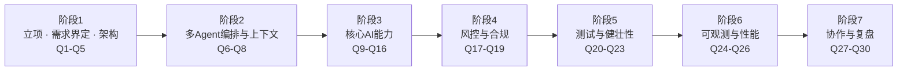

# 阶段 1 · 立项、需求界定与架构设计（Q1–Q5）

## Q1 什么是 MVP？一期的边界怎么定，哪些功能你会主动砍掉？

**一句话答**：MVP 是"能跑通最小业务闭环、能验证核心假设"的最小版本，不是"功能做了一半的版本"；砍功能按"是否阻断业务闭环"排序，砍下来的每一条要写进 `Won't` 清单，而不是"以后再说"。

### ① MVP 是什么

- MVP 三要素：**闭环**（提问 → 检索 → 有依据回答 → 可追溯）＞ 完整（五个 Agent 全上）＞ 精美（好看的前端）。
- 本项目 MVP 判定：能不能让一个客户问出"XX 产品适合我吗"，系统给出有来源、有适当性校验、有 `trace_id` 的回答——这条跑通就有答辩资格。
- **MVP 不是技术降级**：NLP 可以简化，但适当性校验、来源引用、合规免责这三样是红线，MVP 阶段也不能砍。

### ② 边界怎么定

- 用 MoSCoW 定边界：`Must`（互通闭环）/ `Should`（可降级）/ `Could`（加分）/ `Won't`（写死，防膨胀）。
- 砍的依据排序：① 用户感知不到 → ② 有确定规则可替代 AI → ③ 数据/图纸依赖重 → ④ 正反馈慢。
- 典型可砍项：精心打磨的前端可视化、知识图谱的完整本体设计、多轮复杂 ReAct 自规划、性能优化（无并发需求时）。
- 技术选型的**非必然性**：Milvus / Neo4j / GraphRAG 是候选而非必选项；几千条数据时轻量向量库即可，规模上来再评估 Milvus——这是工程师的判断力，不是需求文档给的。
- 变更纪律：口头提的想法不能插队，必须过"影响模块 + 工作量 + 风险 + 是否进本期"的评估。

**加分**：能说出"MVP 要验证的核心假设是什么"（如：RAG 能否满足金融问答准确率），以及"先验证最小闭环，再谈 GraphRAG 深度和前端体验"。
**失分**：把 MVP 说成"先随便做一版以后再完善"；问砍什么时答"都做""先做着看"。

---

## Q2 架构设计与技术方案是怎么确定的？

**一句话答**：按"约束 → 候选 → 评估维度 → ADR 定稿"四步走，选型的产出不是"用了什么"，而是"为什么是它 + 什么时候该换掉它"。

**思路要点**
- 先锁**硬约束**：5 周周期、7 人初级团队、单机资源、教学数据、必须能跑起来 → 直接排除重运维方案（K8s、微服务拆分、流式数据管道）。
- 再列候选，按固定维度打分：业务匹配度 / 团队上手成本 / 运维复杂度 / 替换成本 / 社区活跃度。**评分维度要公开**，否则就是拍脑袋。
- 每个重要决策写一张 **ADR**：问题、候选、选择、理由、代价、复查条件。例："当前几千条数据先用轻量向量库；数据量超过 X 或需要分布式时再评估 Milvus"。
- **诚实留一句**：方案不是最优解，是约束下的最适解——说出代价才是架构师。

**加分**：能说出"什么情况下我会推翻自己现在的选型"。
**失分**：背技术栈清单，讲不出被否决的备选。

---

## Q3 为什么要用四种存储？能不能只用 MySQL？

**一句话答**：四种数据形态（事务 / 会话 / 语义 / 关系）各需要一种引擎，硬塞进 MySQL 会让能力和性能同时劣化。

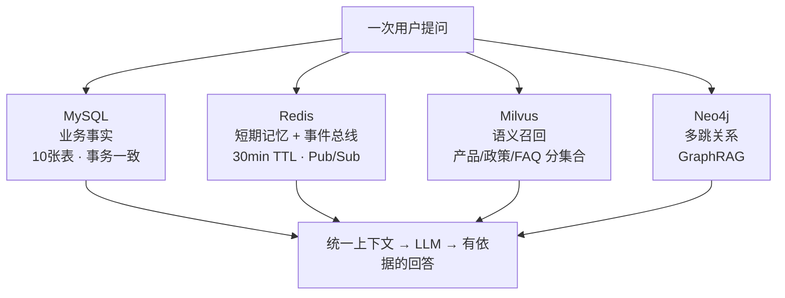

**思路要点**
- MySQL：核心业务数据（用户/画像/产品/交易/持仓/风评/预警/工单/会话归档/知识元数据），要事务和一致性。
- Redis：会话上下文 + 事件总线；要低延迟与自动过期。
- Milvus：语义召回，"T+1 确认"和"多久到账"语义相近但答案不同，LIKE 匹配做不到。
- Neo4j：多跳关系（客户-持仓-产品-行业），三跳以上用递归 JOIN 基本不可用。
- **只用 MySQL 会怎样**：语义丢失、多跳不可行、会话缓存打满库——能做，但劣化明确。
- **代价诚实说**：四种存储带来运维复杂度和"环境要一致"，所以必须 docker-compose 固化。

**加分**：反问"数据量多大？"——少于几千条时承认可以简化。
**失分**："需求文档要求用 Milvus"。

---

## Q4 多个 Agent 是怎么拆的？拆的维度是什么？

**一句话答**：按"服务对象 + 安全等级 + 记忆依赖 + 回复模式"四个维度拆，而不是按技术名词拆；拆的必要性在于——四类用户的诉求、权限和失败代价完全不同，一个通用 Agent 会让权限模型混乱、Prompt 互相污染、出事后无法定位归属。

**思路要点**

| Agent | 服务对象 | 关键技术 | 记忆依赖 | 安全等级 |
|---|---|---|---|---|
| 智能客服 | 客户 | RAG | 短期 | 低（只读+推荐） |
| 投顾助手 | 理财顾问 | GraphRAG | 中期+长期 | 中 |
| 风控监测 | 风控专员 | 规则引擎+置信度 | 中期 | 高 |
| 数据分析 | 内部员工 | NL2SQL | 短期 | 中 |
| 业务操作 | 客户经理 | NL2API+权限 | 短期+中期 | **高（写操作）** |

- 四类用户诉求根本不同：客户要准确答案 + 引用；顾问要画像与推荐；风控要拦截；员工要查数——输出形态都不一样。
- 拆开后才能给每个 Agent 定义**安全等级**，失败代价也可控：客服答错是体验问题，业务操作答错是资金问题。
- 五个 Agent 之间不是"五个独立服务"，而是**共用骨架 + 共用公共能力**（LLM 网关、记忆、追踪、鉴权）。
- 兜底定位：AI 只做"投资分析辅助工具"，输出查询/分析/建议/草稿，最终由**持证人员**对接客户。

**加分**：主动指出文档口径差异——需求文档写"四大 Agent"，功能设计文档与开发指南是五个（多了业务操作），并说明你的最终裁决与理由；再指出安全等级决定了 Supervisor 编排时哪些 Agent 可以被调用、哪些必须二次确认。
**失分**：五个 Agent 五套 LLM 调用代码；或"老师要求拆五个"。

---

## Q5 如果让你从零设计一个 Agent，你会怎么做？

**一句话答**：先问"这个问题真需要 LLM 吗"，然后从**能力边界**倒着设计：能调什么工具、能看什么数据、失败时说什么。

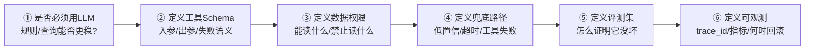

**思路要点**
- **第一问永远是"要不要用 LLM"**：能用确定性规则解决的（适当性匹配、金额校验）绝不交给模型——这是 AI 工程的第一原则。
- 工具要**窄而明确**：一个工具只做一件事，入参有 Schema，失败语义统一，服务端二次校验。
- 兜底是一等公民：低置信 → 澄清提问；无依据 → 拒答 + 转人工；工具失败 → 明确说明失败 + 不编造结果。
- 上线前必有评测集与回滚方案（Prompt / 规则 / 知识库都要能版本化管理）。

**加分**：说"我先把兜底和评测写出来，再写主逻辑"。
**失分**：一上来就聊 Prompt 怎么写。

---

# 阶段 2 · 多 Agent 编排与上下文（Q6–Q8）

## Q6 多 Agent 的编排方式有哪几种？

**一句话答**：主流五种——**Supervisor（主管分发）/ Pipeline（流水线）/ Graph（状态图，含循环与分支）/ Swarm（对等移交）/ Debate（多角色对抗）**，本项目是"Supervisor 分发 + 各 Agent 内部状态图"的混合。

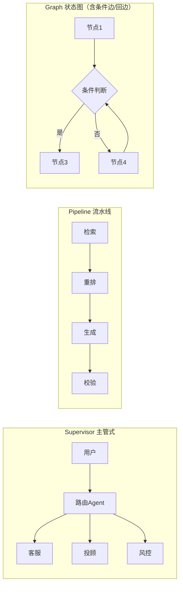

**思路要点**

| 模式 | 适用 | 优点 | 代价 |
|---|---|---|---|
| Supervisor | 场景互斥、路由清晰 | 责任清晰、易观测 | 主管成为单点，路由错全错 |
| Pipeline | 固定顺序加工 | 简单可预测 | 无法回退、容错差 |
| **Graph（LangGraph）** | 需循环/回退/条件分支 | 表达力最强、可持久化状态 | 设计与调试成本高 |
| Swarm | 专家对等移交 | 灵活 | 难预测、易循环 |
| Debate | 高风险决策 | 降低单模型偏见 | 成本高、延迟大 |

- 本项目的实际做法：**意图路由（Supervisor）+ 事件广播（Redis Pub/Sub）**，各 Agent 内部是 观察→判断→行动→反思 的固定骨架，而不是自由编排——这是刻意的可控性取舍。

**加分**：说"我用 Graph 不是为了炫技，是因为业务里有回退和重试（工具失败要降级重试）"。
**失分**：把"多 Agent"等同于"多轮对话"。

---

## Q7 多 Agent 之间的通信机制：消息传递 vs 共享状态 vs 黑板模式？

**一句话答**：三种通信范式其实是**耦合度与可追溯性的三角权衡**，本项目用"共享存储（中期/长期记忆）+ 事件消息（通知）"的混合。

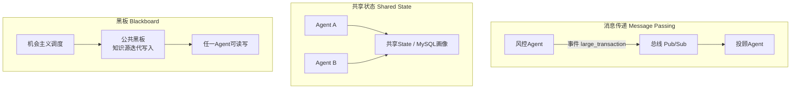

**思路要点**
- **消息传递**：解耦最好、易追溯（每条消息可查），但难传大体量上下文，且顺序/一致性要靠总线保证。本项目的大额交易事件就是这一机制。
- **共享状态**：读写方便、适合画像/工单这类结构化事实（一个写多个读），但容易产生写冲突，必须定义 Owner 与写入规则。
- **黑板**：适合"不知道谁能解、谁有贡献谁写"的开放式推理，灵活但难调试、难审计——**金融场景慎用**。
- 选择依据：**是否会改变数据归属 + 是否需要审计** → 需要审计就别用黑箱黑板。

**加分**：指出本项目是混合——事实走共享存储（可查），通知走事件（解耦），Agent 之间绝不互相持有长上下文。
**失分**：只答"用 Redis 发消息"，说不出为什么有些数据不放消息里。

---

## Q8 多 Agent 之间的上下文怎么处理？怎么解决"信息爆炸"？

**一句话答**：先**分层**（短期/中期/长期），再**压缩**（摘要 + 结构化），最后**按预算投放**（每个 Agent 只给它完成任务所需的最小上下文）。

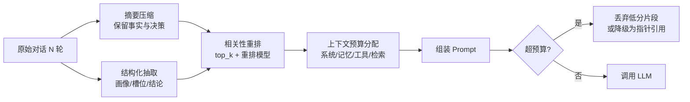

**思路要点**
- **不要全量传递**：跨 Agent 只传"结论 + 依据 ID"，接收方按需回查，而不是把上游原文塞过去。
- **把对话变成数据**：多轮对话沉淀为结构化画像/槽位/工单状态（本项目中期记忆），这是最有效的压缩。
- **三道闸门**：① 相关性重排（不是 top_k 越大越好）② 上下文预算分配（系统/记忆/工具/检索各占多少 token 要显式规划）③ 过期淘汰（30min TTL、画像衰减重算）。
- **信息爆炸的典型症状**：Prompt 越来越长 → 模型忽略中间信息（lost in the middle）→ 准确率反而下降、成本线性上升。这本身就是一个很好的 Bad Case。

**加分**：说出"lost in the middle"现象和它对准确率的影响。
**失分**："多传点上下文总没错"。

---

# 阶段 3 · 核心 AI 能力实现（Q9–Q16）

## Q9 意图识别的主流方案有哪些？怎么优化效果？

**一句话答**：四代方案——关键词规则 / 传统分类器 / 向量相似度 / LLM 结构化分类（可微调小模型），工程上最优解通常是**级联**：便宜的先兜，难的交给 LLM。

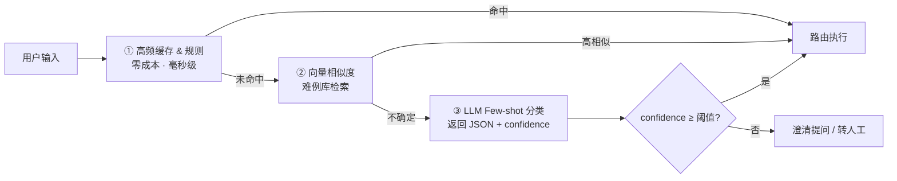

**思路要点**
- 本项目做法：Prompt + 结构化输出（`{"intent": "...", "confidence": 0.X}`）+ 阈值卡口（客服 0.6，资金类操作应更高）。
- **优化六招**：① 意图清单互斥且收敛（重叠的意图是准确率第一杀手）② 动态 Few-shot（按相似度挑最像的 3–5 个例）③ 难例集回流（Bad Case 直接变成 Few-shot）④ OOD/负样本（"不在五个意图内"要能识别并拒答）⑤ 置信度阈值 + 澄清/降级路径 ⑥ 高频意图缓存（省时省钱）。
- 降本手段：稳定后可用历史数据微调一个小分类器（BERT），把 80% 的请求从 LLM 上摘下来。
- **评测方式**：混淆矩阵 + 每类意图的精确/召回，不能只看总体准确率（样本不均衡会掩盖少数意图的全错）。

**加分**：提出"意图不是越多越好，重叠意图要合并"。
**失分**：只说"用 LLM 分类"，没有阈值和兜底。

---

## Q10 RAG 全链路讲一遍，0.7 这个阈值怎么来的？

**一句话答**：检索-过滤-生成三段式，**阈值是量出来的不是拍出来的**，且必须有检索失败的兜底路径。

**思路要点**
- 链路：解析 → 切分 → Embedding → 分集合入库（产品 / 政策 / FAQ）→ top_k=5 → `min_score=0.7` 过滤 → 构建含来源的 System Prompt → `temperature=0.3` 低温度生成 → 输出附来源引用。
- **为什么分集合**：三类知识权威性不同，政策类答错有合规风险，必须绑死知识库，不能让模型自由发挥。
- 阈值标定：在评测集上统计"正确召回的最低分"与"错误召回的最高分"分布，取分界点；并做敏感性分析看 0.65 / 0.7 / 0.75 的正确率-拒答率曲线。
- 兜底：`results[0].score < 0.7` 返回兜底并引导人工；"转人工"是一等公民意图，不是异常分支。

**加分**：提到 chunk 大小/重叠做过实验，以及 rerank 的收益与延迟代价。
**失分**："用了框架默认配置"；说不出检索失败会怎样。

---

## Q11 GraphRAG 解决了什么问题？什么时候反而不如向量检索？

**一句话答**：它解决的是**多跳关系推理**（"买了 A 的客户还买了什么""持仓涉及哪些行业风险"），但关系稀疏或图谱质量差时，它只会引入噪声和延迟。

**思路要点**
- 图谱：节点（客户/产品/持仓/行业）+ 关系（持有/属于/申购），用 Cypher 取子图 → 子图结构化 → 作为上下文喂 LLM。
- **不如向量检索的三类场景**：纯事实问答（"基金申购后多久确认"）、关系极度稀疏、实体对齐质量差。
- **诚实边界**：GraphRAG 的上限由图谱质量决定；实体抽取错误会直接导致错误推荐——所以贪心地"加个图谱"很常见，但往往是负收益。
- 与 RAG 的关系是**互补而非替代**：通常先做 RAG 基线，确认向量检索覆盖不了哪些问题，再决定图谱上不上。

**加分**：能给出一个真实的多跳查询 Cypher 例子。
**失分**："GraphRAG 一定更强"。

---

## Q12 NL2SQL：如何弥合"数据库 Schema"与"自然语言"的语义鸿沟？怎么保证不查错、不查爆、不越权？

**一句话答**：弥合靠**喂对上下文**（动态 Schema + Few-shot + 业务术语映射），安全靠**模型之外的确定性校验层**。

**思路要点**
- **弥合语义鸿沟的四件事**：① 只注入相关表的 DDL（10 张表全注入超 4000 token，既贵又降质量）② 字段要有中文注释/语义说明 ③ 业务黑话映射表（"多少钱"→ amount，"最近"→ 近30天）④ 按意图挑对应 Few-shot。
- **注意这里的意图分类不是为了路由**，而是为了决定注入哪几张表、挑哪组 Few-shot——与 Q9 的路由型意图识别目的不同。
- **安全三道闸**：正则拦截 DROP/DELETE/UPDATE/INSERT → 强制 `LIMIT 100` → **数据库只读账号**（最后一道，绕过应用层也改不了数据）。
- 承认取舍：正则而非 AST 解析，是因为简单、覆盖全；AST 更精确但复杂，内部系统可接受正则的误判率（宁可错拦不可放过）。
- **越权场景要专门测**：如"导出所有客户手机号"——除 SQL 校验外，还要按角色做行级/列级过滤。

**加分**：主动补充"结果也要脱敏"，点出端到端安全。
**失分**：只有"让 LLM 生成 SQL"。

---

## Q13 业务操作 Agent 的执行链路？参数幻觉怎么防？

**一句话答**：Parse → Validate → Confirm → Execute → Verify，五步缺一不可；核心是**绝不信任模型输出的参数**。

**思路要点**
- **Parse**：意图识别 + 结构化参数抽取（走 Function Calling / Schema）。
- **Validate**：服务端二次校验 + 权限矩阵（这个角色能不能替这个客户做这个操作）+ 存在性校验（客户 ID、产品 ID 必须查得到）。
- **Confirm**：金额超阈值（如 1 万）必须二次确认，返回待确认的结构化摘要给用户。
- **Execute → Verify**：执行后回查结果，确认状态真的变了，再回复用户——不要执行完就假设成功。
- **事件联动**：大额交易（> 5 万）发布事件给风控 Agent，形成闭环（操作与风控不是孤岛）。
- 幂等见 Q14。

**加分**：讲出"即使模型重试三次，也不会产生三次申购"（自然引到幂等）。
**失分**：直接 `await purchase(...)`。

---

## Q14 基于 AI 的后端业务系统为什么需要幂等性？

**一句话答**：因为 LLM 的输出不确定、框架会自动重试、工具可能被并发触发——同样是重执行一次的下单/扣款，在传统系统里是异常，**在 AI 系统里是常态**。

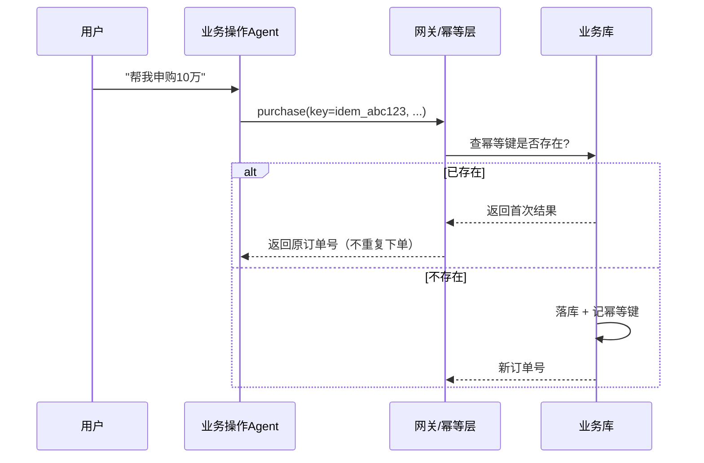

**思路要点**
- **为什么 AI 系统更需要**：① 模型可能重复发起同一个工具调用 ② Agent 循环/重试机制会重放 ③ 用户可能并发重复发送 ④ 流式中断后前端重发。传统系统里"重试"是异常，这里它是**设计的一部分**。
- **实现三件套**：① 客户端或服务生成的 **幂等键**（idempotency key，带上业务语义如 user+intent+金额+时间窗）② 服务端幂等表/唯一索引去重 ③ **状态机 + 唯一流水号**（本项目 `fin_transaction.transaction_no`、`biz_work_order.order_no` 就是天然幂等锚点）。
- **重放语义**：命中已有幂等键时要返回首次执行的结果，而不是报错——否则用户看到失败又发一次，反而更容易产生重复。
- 幂等不仅针对写：重复通知客户、重复生成工单、重复扣款同样要防。

**加分**：提到"模型 temperature=0 也不能保证幂等，因为重试是框架层行为"。
**失分**：把幂等等同于"数据库唯一索引"（那是手段之一）。

---

## Q15 三层记忆分别是什么？存在哪？生命周期多长？会话结束怎么归档？

**一句话答**：短期 Redis（会话上下文，30min TTL） / 中期 MySQL+Redis（画像、工单状态，Cache-Aside） / 长期 Milvus+Neo4j+MinIO+MySQL（知识、图谱、文件、归档）。

**思路要点**
- **短期**：多轮上下文，按 token 截断；结束时写入 `conversation_archive`（对话内容 + 工具调用记录），**归档前必须脱敏**。
- **中期**：客户画像、工单状态，"再次问我要推荐什么"时不依赖历史对话全文，而依赖结构化画像——这是压缩的关键。
- **长期**：知识与图谱，跨会话、跨用户共享。
- **治理**：按用户和会话隔离；提供过期、纠错、删除机制；测试/日志/Prompt 中不得放真实敏感数据。
- 各 Agent 依赖不同：客服靠短期、投顾靠中期+长期、业务操作靠短期+中期（权限）。
- 存储选型详见 Q3，本题重点是**生命周期与治理**。

**加分**：说出"记忆不是把历史全塞进 Prompt，而是把历史变成数据"。
**失分**：把历史消息列表当成记忆架构。

---

## Q16 置信度体系怎么设计？基础分怎么算，为什么要周期校准？

**一句话答**：三层结构——基础置信分计算 → 综合重排 → 周期校准；它的价值是**让"模型不确定"变成系统可处理的信号**。

**思路要点**
- 基础分来源：数据来源可靠性（AI 评估 > 用户自述）、时效（风评过期要降权，监管一般一年一评）、命中规则数（单规则低 / 多规则中 / 多源交叉高）。
- 综合重排：多路召回按置信度重排，低置信不输出，转澄清或转人工。
- 周期校准：画像置信度随时间衰减，定时全量重算（本项目提供手动触发接口），低于阈值触发重算。
- **必须可解释**：能说出"为什么给这个分"——哪条规则、哪个来源、什么时效，否则置信度只是一个不可信的数字。
- 注意两点：① 这是**独立于模型自评 confidence 的计算体系**，不能直接用模型的自我输出；② 它区别于 Q9 里用于路由的**意图置信度**——前者决定"敢不敢输出结论"，后者决定"交给哪个 Agent"。

**加分**：指出"模型返回的 confidence 不可作为最终裁决依据"。
**失分**："模型说自己 0.9 就是 0.9"。

---

# 阶段 4 · 风控与合规（Q17–Q19）

## Q17 20 条风控规则怎么组织？三级预警怎么判定？单条命中就报警吗？

**一句话答**：按权重分组 + 命中数交叉验证，**三级（蓝/黄/红）而非两级**，因为"大量交易"和"关联交易"的处置流程完全不同。

**思路要点**
- 分组：R001–008 强规则（大额、高频）；R009–020 异常行为模式（拆分交易、夜间交易、新开户大额）。
- 判定：命中规则数 + 权重 → 级别；**弱规则单条命中不预警**，需联合触发。
- **重复触发升级**：同一客户同类型预警反复出现 = 持续性行为模式，置信度从"单次低"提升到"持续性高"。
- 落地：预警写 `fin_risk_alert` → 联动生成 `biz_work_order` 工单（可疑交易上报）→ 事件广播给相关 Agent。

**加分**：提到规则配置化（不改代码加规则）和误报率治理。
**失分**："命中就报警"。

---

## Q18 适当性红线怎么保证技术上不可绕过？"不代客交易"和"业务操作 Agent 能执行申购"矛盾吗？

**一句话答**：适当性校验必须是放在模型之外的**确定性最终裁决层**；至于"矛盾"——这是陷阱题，必须诚实指出并给出落地方案。

**思路要点**
- 不可绕过三要素：① 校验逻辑在模型之外（模型输出只作为输入，不能决定是否执行）② 不匹配直接拦截 + 记录规则编号 + `trace_id` ③ 有专门的单元测试用例（R2 客户 + R4 产品必须拦截）。
- 扣分红线：C1 客户绝不能购买 R4/R5 产品。
- **关于矛盾（关键加分）**：需求文档明确"AI 不得代替客户执行申购赎回转账"，功能设计文档却有业务操作 Agent 执行转账/赎回。正确答法：
  1. 明确指出这是口径差异，需要团队裁决；
  2. 教学落地方式：走**工单 + 二次确认 + 人工审核**，AI 只产生操作工单草案，由持证人员确认后走后续流程，**不直接下单**；
  3. 所有面向客户的输出必须带免责声明。

**加分**：主动发现文档矛盾，而不是顺着答。
**失分**：没发现矛盾，或直接说"我们直接执行申购"（合规硬伤）。

---

## Q19 针对金融场景的合规性与可追溯性，架构上做了哪些针对性方案？

**一句话答**：三个抓手——**全链路可追溯（一切回答可还原）/ 确定性合规裁决（不让模型说了算）/ 数据最小化与留痕（看得见的才敢用）**。

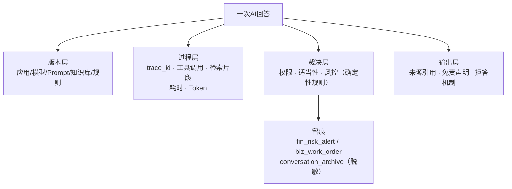

**思路要点**
- **一次回答要能还原**：应用版本、模型版本、Prompt 版本、知识库版本、规则版本、检索片段、工具调用、Token、耗时、`trace_id`——缺一项就查不清。
- Prompt 与规则必须**纳入版本管理**（禁止只在个人电脑上改），这样出问题能 diff。
- **数据治理**：客户姓名/证件号/手机号/资产/流水按角色脱敏，`conversation_archive` 归档前脱敏；数据标注来源、Owner、敏感级别、保留期限。
- **合规输出**：固定的免责声明模板必须出现在所有面向客户的分析类输出中（"本内容仅为投资分析参考，不构成任何直接投资建议……"）；无依据或超范围的问题明确拒答并转人工。
- 红线如何在代码层落地见 Q18，本题讲**体系与留痕**。

**加分**：提到"版本化 + trace_id 是出事故后唯一能自证清白的东西"。
**失分**：只说"加了免责声明"。

---

# 阶段 5 · 测试、评测与健壮性（Q20–Q23）

## Q20 你们做了哪些测试？分层怎么分的？

**一句话答**：七个层次：单测 / 接口 / 集成 / 端到端 / **AI 回归** / 安全 / 性能，其中 AI 回归和安全测试是传统项目没有的增量。

**思路要点**
- 触发时机：单测每次改代码；接口每次新增；集成每个 Phase 末；E2E 在 P5；AI 回归在模型/Prompt/知识库/规则变更后；安全测试每版发布前。
- 测试数据要有版本与四类样本：正常、边界（18 岁 / 80 岁 / 资产 0）、异常（空串、特殊字符、注入串）、权限（不同角色访问同一客户的允许/拒绝）。
- 代表性用例要说得出断言的意义：`test_sql_generation`（必须 SELECT 且不含 DROP/DELETE）、`test_suitability`（R2+R4 必须拦截）、`test_faq_search`（有结果且 top1 ≥ 阈值）。
- 本题讲**分层结构与触发时机**，Agent 特有的异常场景测试见 Q21。

**加分**：诚实说"哪些地方我们没写测试，为什么"。
**失分**：只有 `assert response.status_code == 200`。

---

## Q21 如何测试 Agent 编排的健壮性？（节点逻辑 / 路由分支 / 工具失败 / 低置信转人工）

**一句话答**：把编排当成**可断言的状态机**来测——节点测纯函数，图测路径，异常测降级，用 Mock 把 LLM 和工具的不确定性关掉。

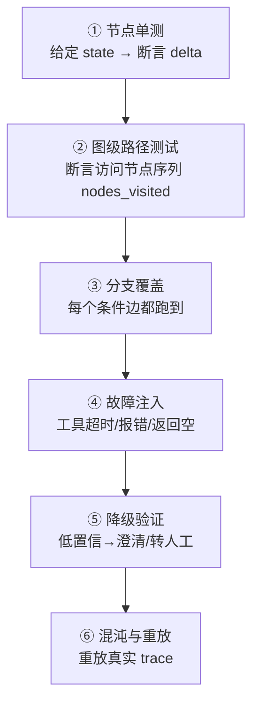

**思路要点**
- **节点逻辑**：把每个节点写成"输入 state → 输出增量"的纯函数（LLM 调用通过依赖注入 Mock 掉），单独断言，这是成本最低、收益最高的一层。
- **路由分支**：给图一个初始 state，断言实际走过的节点序列（如 `["intent", "rag_search", "generate"]`），确保两条条件边都被覆盖；不要只测最终答案字符串。
- **工具失败**：注入三类故障——超时、返回错误、返回**空结果**（最容易漏，很多同学只 mock 成功和抛异常）；验证 Agent 的行为是"重试 → 降级 → 明确告知用户"，而不是"编一个结果"。
- **低置信转人工**：把 `confidence` 直接塞进 state（Mock 意图返回值），验证走的是澄清/转人工分支，而不是硬答。
- **非确定性怎么办**：LLM 用 Mock/回放（record & replay），`temperature=0`，断言改为"包含关键事实"而非全等字符串；重要场景断言链路而不是措辞。
- **回归**：把线上 Bad Case 直接固化成测试用例，进 CI。

**加分**：提出"断言 Agent 走了哪条路，而不是只断言输出什么"。
**失分**：只做 happy path，工具失败一测就崩。

---

## Q22 用 LangGraph 怎么验证状态流转是否正确？如何避免死循环？

**一句话答**：用 StateGraph 把流转显式化后，**防死循环靠"出口条件 + 步数预算 + 重复状态检测"三重保险**；验证手段见 Q21。

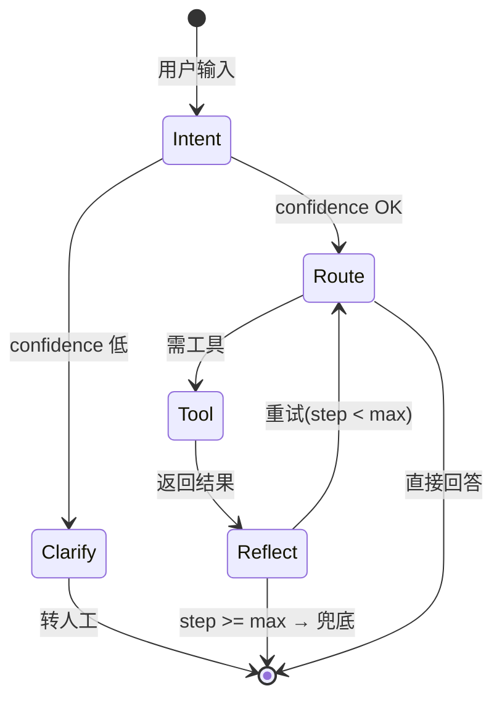

**思路要点**
- **防死循环四件套**：
  1. **每条回边都有明确出口条件**（"重试"必须有 `step >= max` 的出口，否则就是死循环的源码）；
  2. **步数预算**：给图设 recursion/step 上限（如 25），超了强制走兜底节点；
  3. **重复状态检测**：记录 (节点, 参数摘要) 指纹，重复出现即中断——专门治"反思节点反复发出同样的动作"；
  4. **时间与成本上限**：总耗时/总 Token 预算，到了就停——这是资金意识。
- **LangGraph 特有优势**：状态是显式对象 + checkpointer 持久化，因此可以"重放到某一步再改线继续"，调试和测试都比自由 ReAct 循环强。

**加分**：说出"没有出口条件的回边就是 bug"，以及步数/预算这类**资金安全**视角。
**失分**：只答"设置 max_iterations"，没有重复状态检测和成本兜底。

---

## Q23 你怎么证明"AI 效果好"？黄金测试集怎么建？

**一句话答**：不能靠临时想几个问题——要有**固定评测集 + 基线 + 回归纪律**，并且 CI 化。

**思路要点**
- 评测集要素：输入、预期结果、允许误差、风险级别、数据版本。
- 样本构成要覆盖：典型问题、多轮歧义、**无答案问题**（测拒答能力）、提示词注入、工具失败、越权查询。
- 指标不只是"像不像"：召回率、答案正确性、**引用真实性**（有没有编来源）、拒答能力、延迟、Token 成本。
- 回归纪律：模型/Prompt/知识库/规则/切片任一变更都要重跑同一套，**不能事后为通过而下调阈值**。

**加分**：说出上次改 Prompt 后指标的变化幅度（哪怕变差了）。
**失分**："我自己问了几个，感觉还行"。

---

# 阶段 6 · 运行期：可观测与性能（Q24–Q26）

## Q24 智能体整套链路的可观测怎么做？有哪些 Agent 特有的监控指标？

**一句话答**：传统 RED/USE 指标之上，加**LLM 语义层指标**；关键是所有环节被同一个 `trace_id` 串起来，否则 Agent 的失败无法归因。

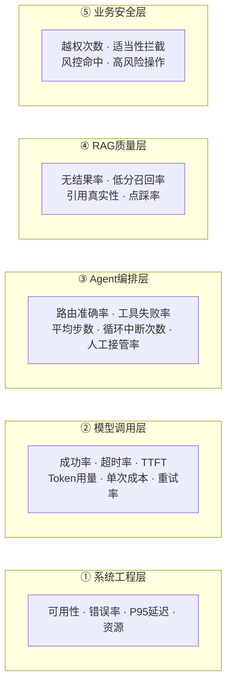

**思路要点**
- **四类 Agent 特有指标**（传统后端没有）：路由准确率、工具调用失败率、**平均步数**（突然变高通常意味着在打转）、**引用真实性/拒答率**。
- 必须有 `trace_id` 贯穿：一次回答 = 一棵调用树（意图 → 检索 → 工具 → 生成 → 归档），出问题能逐层下钻。
- 工具层面要记录：工具名、参数摘要、结果、耗时、操作者、`trace_id`（支持审计）。
- **告警要指向能处理的人**，不能只记日志；高风险告警要有通知方式、响应时限、升级路径。

**加分**：提出"在线指标要能回灌到离线评测集"（点踩 → 变评测样本）。
**失分**：只有 CPU/内存/QPS。

---

## Q25 LLM Cache 能解决什么问题？Agent 系统中如何设计 context 以提高并稳定命中率？

**一句话答**：Cache 解决成本、延迟和限流下的稳定性；提高命中率的核心原则是——**把易变的放末尾，把稳定的放开头**（前缀缓存要求前缀完全一致）。

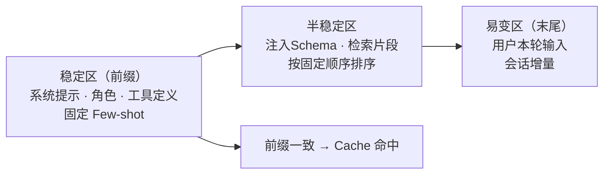

**思路要点**
- **Cache 解决四件事**：重复查询的成本、首 token 延迟、限流/429 下的可用性、模型调用抖动带来的不稳定。
- **提高命中的六条**：① 系统提示与工具定义固定在最前（顺序和空格都不能变）② 不要把时间戳、UUID、随机数放进前缀（前缀一旦不一致，prefix cache 会整体失效）③ 检索片段按**稳定的 key 排序**（score+id 而不是召回顺序）④ Prompt 模板化，变量位置固定 ⑤ `temperature=0` 才适合做结果缓存 ⑥ 分层缓存：精确哈希 → 语义相似缓存（embedding 阈值判定）。
- **缓存键必须包含版本号**：模型版本 + Prompt 版本 + 知识库版本 + 工具 Schema 版本，**任一变更必须失效**，否则你会拿到用旧知识生成的"看起来很自信"的错误答案。
- 失效策略：知识库更新即失效；写操作/状态查询类**绝不能缓存**（这点在金融系统尤其重要）。

**加分**：提到"语义缓存的相似度阈值怎么定、误命中有什么后果"。
**失分**："把整个 prompt 丢进 Redis"（没考虑前缀一致性）。

---

## Q26 Python 中多线程、协程有什么区别？你这个项目哪里用哪个？

**一句话答**：协程解决"等待"（IO 并发）且在单线程内由事件循环调度、开销极小；多线程受 GIL 限制无法并行算，**适配合阻塞式 IO 库**；CPU 密集用多进程。

**思路要点**

| 维度 | 多线程 `threading` | 协程 `asyncio` |
|---|---|---|
| 调度方 | 操作系统抢占式 | 用户态事件循环协作式 |
| 并行能力 | 受 GIL 限制，CPU 密集无法并行 | 单线程，同样不能并行算 |
| 切换开销 | 大（上下文切换 + 锁） | 极小 |
| 适用 | 阻塞式第三方库、少量并发 | 大量 IO 并发（HTTP/DB/Redis） |
| 典型坑 | 竞态、需要锁、难调试 | 一处阻塞调用卡死整个循环 |

- 本项目用法：**FastAPI `async def` + async 客户端**处理 LLM 调用、Milvus/Redis 访问（天然 IO 密集）；若某个库只有同步版本，用线程池 `run_in_executor` 包一层，避免卡死事件循环。
- CPU 密集场景（批量 embedding、文档解析）用进程池；周期任务（置信度全量重算）走独立任务队列/定时任务，不占请求线程。
- **最容易踩的坑**：在 `async def` 里调用同步的 `requests`/阻塞 ORM，会把整个事件循环堵死——并发能力瞬间回落到 1。

**加分**：说出"async 不等于快，是并发不是并行"。
**失分**："协程更快所以用协程"。

---

# 阶段 7 · 协作、交付与复盘（Q27–Q30）

## Q27 7 人并行开发怎么避免冲突和重复造轮子？讲一个真实冲突。

**一句话答**：靠"公共能力先收敛 + 契约先行 + 小步提交"，冲突不可怕，可怕的是不知道这个文件归谁。

**思路要点**
- **公共能力只实现一次**并指定唯一 Owner：LLM 网关、配置与密钥、身份权限、数据访问、Agent 与工具协议、记忆服务、日志追踪、统一响应。
- 契约先行：API 字段、工具 Schema、表字段与枚举、事件名称与载荷先约定；未实现时用 Mock/Stub 并行，不互相等待。
- Git：禁推 main/develop，feature 分支 + PR + 至少 1 人 Review；每个 todo 控制在 0.5–2 小时，提交即自测。
- 冲突先看归属：不是自己负责的模块找负责人一起改；典型冲突是 `requirements.txt` 与 `app/api/chat.py`。
- 团队规模要对齐（需求文档 5 角色支持 3–5 人合并 vs 开发指南 7 人 A–G，需给映射规则）。

**加分**：讲得出一次真实的冲突和当时的判断过程。
**失分**："我没遇到冲突"；"我覆盖了他的代码"。

---

## Q28 你们怎么定义"完成"？什么是 DoD？哪一条最容易漏？

**一句话答**：DoD（Definition of Done，"完成的定义"）是团队事先约定好的一张**通用验收清单**——一个需求只有打满这张清单，才允许被说成"做完"、才允许合入主干；它的作用是消灭"代码写完了""我电脑上能跑"这种口头完成。

### ① DoD 是什么

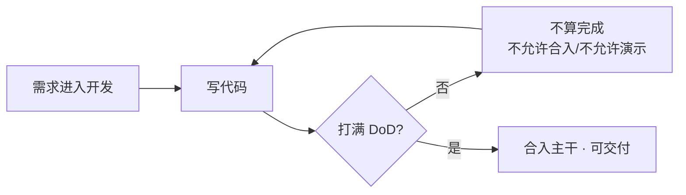

- **DoD ≠ 验收标准**：验收标准（Acceptance Criteria）是**针对某一个需求**的（"R2 客户推荐 R4 产品时必须拦截"），回答"这个需求做对了吗"；DoD 是**对所有需求一视同仁**的工程底线，回答"该做的动作都做全了吗"。两者都要有，缺一就会出现"功能对但跑不起来"或"能跑但没测试"。
- **为什么要有 DoD**：它把"完成"从个人感觉变成团队共识，避免联调时才发现对方没写测试、没更新文档、没考虑回滚——这是多人并行项目里成本最低的一致性工具。
- **谁定、什么时候定**：项目启动时由团队共同约定并写进 README，中途可以加条目（加了就全员生效），但不能对单个需求临时放宽。

### ② 本项目的 DoD 清单与最容易漏的三条

- 清单：功能正确且对应验收标准；核心函数/接口有测试并通过；AI 能力回归达标；Swagger 可访问；README 更新；环境可启动（docker-compose 能一把拉起）；至少 1 人 Review；无硬编码敏感信息；日志可排查；数据库/接口/配置变更有迁移与回滚说明。
- **最容易漏的三条**：README 没更新导致别人跑不起来；库表/配置变更没写迁移说明；改了 Prompt 没跑评测回归。
- 提交前清理：`.env`、`__pycache__`、临时文件、大文件不入库。

**加分**：承认自己漏过哪条、后来怎么补的；能说出 DoD 和验收标准的区别。
**失分**：背完清单说不出"为什么要有 DoD"。

---

## Q29 开发中有没有用 Vibe Coding / AI 辅助编程？踩过什么坑？哪些代码你绝不让 AI 写？

**一句话答**：用了——它能极大加速样板、SQL、测试用例和文档，但它的产出必须满足"讲得清、跑得动、有测试、无幻觉依赖"四条才允许合并。

**思路要点**
- 常用场景：脚手架、样板代码、SQL 草稿、Prompt 初稿、测试用例、文档。
- **真实踩过的坑**（举例要具体）：编出不存在的库/API 版本；代码能跑但是 O(n²)；边界条件错（空值、负数、精度）；改 A 处悄悄破坏 B 处；改完 Prompt 一个场景变好另一个悄悄退化且没被发现。
- **绝不交给 AI 的四类**：接口契约与公共能力、权限/风控/适当性校验、金额与精度计算、评测集与阈值。
- 收口：凡是 AI 产出的关键逻辑，必须能讲清原理 + 有测试。

**加分**：给出一个具体到"哪一行、怎么发现、怎么修"的坑。
**失分**："全程 AI 写，我基本没看"；或全盘否认用过（不可信）。

---

## Q30 讲一个典型的 Bad Case，以及你是如何定位和解决的？

**一句话答**：推荐答一个**能展示定位方法论**的 Bad Case——答对某一道题不重要，重要的是你能不能在黑盒里一层层往下切。

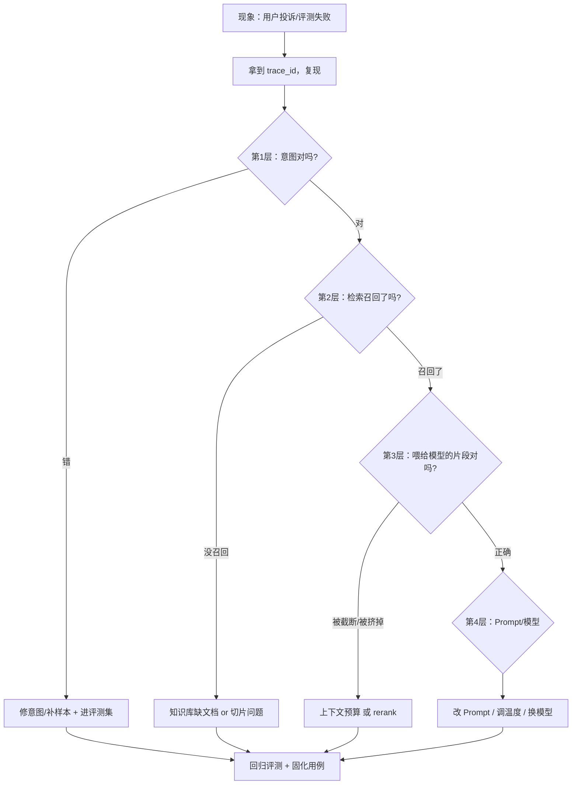

**思路要点**（挑一个讲，别贪多）
- **推荐讲的 Bad Case 类型**（越具体越可信）：
  1. **答非所问**：意图路由错了 → 补难例进 Few-shot、加阈值澄清分支；
  2. **答案有来源但结论错**：召回到了文档但文档过期/冲突 → 建知识元数据的有效期字段 + 拒答；
  3. **LLM 幻觉来源**：模型编造引用 → 强制只使用检索片段编号引用 + 引用真实性校验；
  4. **演示翻车**：环境不一致导致起不来 → docker-compose 固化 + 干净环境冒烟；
  5. **越权**：NL2SQL 生成了查全表的 SQL → 加行级权限过滤 + 只读账号。
- **讲法模板（照这个顺序，得分最高）**：现象 → 影响范围 → **如何定位**（用了什么证据：trace/评测集/日志）→ 根因（不要停在表象）→ 修复 → **如何防止复发**（进评测集/加校验/加告警）→ 这件事改变了你什么做法。
- 关键是展现**归因能力**：能在"模型 / Prompt / 知识库 / 检索 / 工具 / 数据 / 权限"这几层里快速缩小范围，而不是上来就改 Prompt。
- 本题讲"系统/模型问题的归因"，AI 生成代码踩过的坑见 Q29。

**加分**：结局是"改了流程而不是只改了一行代码"（例如新增了一类 lint 检查、新增了一组回归用例、把某项校验前移到确定性层）→ 体现工程成长。
**失分**：讲的 Bad Case 最后不了了之，或者根因归咎于"模型不行"。
