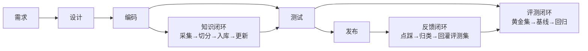
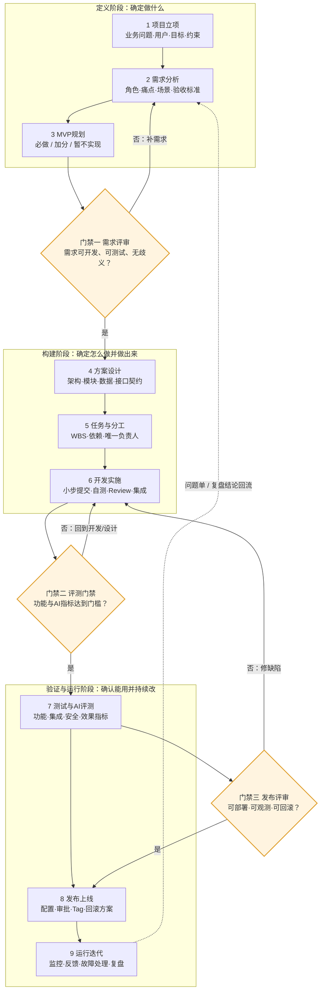
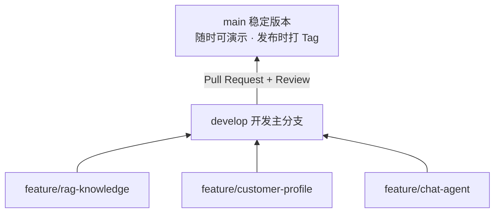
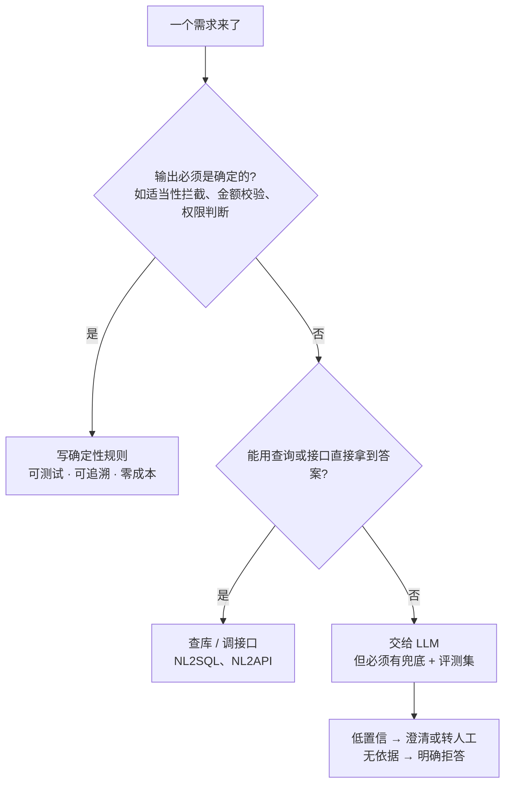
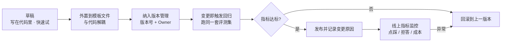
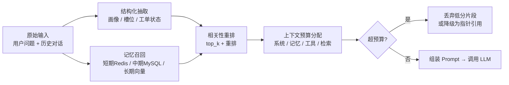
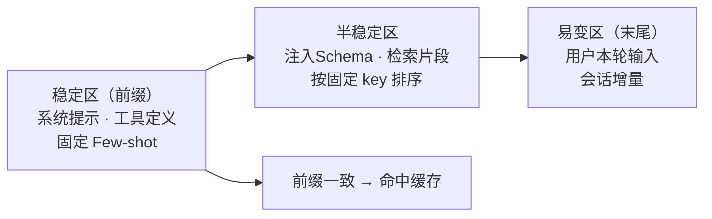

# AI金融项目开发指南（企业流程版）

---

## 零、先搞清楚：AI 项目和普通项目差在哪  `必修`

本指南里的大部分流程（需求、评审、Git、测试、发布）在任何软件项目里都成立。真正值得单独学习的是下面这张表——**这七条差异，就是本指南要带领学员总结的核心**。

| # | 维度 | 普通软件项目 | AI 项目 |
|---|---|---|---|
| 1 | 输出性质 | 确定性：同样输入必得同样输出 | 概率性：同样输入可能不同输出，**只能约束，不能保证** |
| 2 | 如何判断对 | 断言与期望值相等即可 | 只能评测：需要黄金测试集 + 基线 + 指标（8.1） |
| 3 | 核心资产 | 代码与数据 | 代码 + 数据 + **Prompt + 知识库 + 评测集**，三者都必须是版本化对象（7.2） |
| 4 | 失败方式 | 报错、崩溃、结果不对 | **"看起来对"**——不报错但内容错，这是最危险的失败 |
| 5 | 兜底设计 | 异常处理即可 | 必须显式设计：低置信澄清、无依据拒答、工具失败降级、转人工（7.1） |
| 6 | 成本模型 | 主要是人力与服务器 | 每次调用都计费：调用量 × Token × 重试次数，Agent 打转会直接烧钱（7.4） |
| 7 | 变更影响 | 改代码的影响范围已知 | 改 Prompt / 知识库 / 模型版本都会改变行为，**必须跑回归评测** |



除了传统流程，AI 项目多出**三条闭环**，缺一条效果就不可控：

- **知识闭环**：知识库不是一次性的。文档有有效期、有权限、要更新，否则会召回已废止政策（7.7）。
- **评测闭环**：没有基线就没有"变好了还是变坏了"的判据，改 Prompt 全凭感觉（8.1）。
- **反馈闭环**：线上点踩与转人工要归类回灌评测集，避免"看到坏答案就只改 Prompt"（14.2）。

---

## 一、先看文档再开始  `必修`

### 1.1 项目是什么

本项目是**智能财富管家系统**，核心思路是：用户用自然语言提问，系统结合大模型、知识库、客户画像、数据分析等工具生成回答。

**通俗理解**：不是简单调一个API，而是让AI"查资料、看数据、用工具"后给出专业回答。

### 1.2 用户是谁

- **外部客户**：咨询理财产品、查询持仓
- **理财顾问**：获取客户画像分析、产品推荐
- **风控专员**：监测异常交易
- **内部员工**：用自然语言查业务数据

### 1.3 系统要做什么

围绕**知识问答、客户画像、投顾建议、风险预警、自然语言查数、业务操作**六类业务场景组织系统，多 Agent 协作、记忆体系和工程化能力作为底层支撑。

**关键概念快速理解**：
- **"客户画像"**：把客户的年龄、收入、风险偏好等信息结构化，系统可用
- **"RAG"**：先查知识库相关资料，再让模型回答，避免"胡编乱造"
- **"NL2SQL"**：把自然问题翻译成SQL去查数据库
- **"NL2API"**：从自然语言中提取操作参数，经权限和风险校验后调用业务接口
- **"Agent"**：能够理解任务、选择工具并根据执行结果继续处理的智能模块

**一处必须先裁决的口径**：需求文档中写的是"四大 Agent"，功能设计文档与本指南按**五个 Agent** 落地（多出"业务操作"）。本指南统一按五个执行：`customer` / `advisor` / `risk` / `analyst` / `operator`。注意"六类业务场景"不等于"六个 Agent"——客户画像是投顾 Agent 的前置能力，不单独成为一个 Agent。团队人数不足 5 人时，按 5.4 的角色合并规则处理。

### 1.4 必读文档清单

在开始编码前，必须阅读以下文档：

| 文档 | 位置 | 用途 |
|------|------|------|
| 需求文档（**最终版**） | `需求文档-修改版.html` | 了解系统要做什么；**以这一份为准** |
| 需求文档（修改痕迹版） | `需求文档_标记修改内容.html` | 查看相对上一版改了什么，仅用于追溯，不作为开发依据 |
| 功能设计文档 | `功能设计文档.html` | 了解功能流程和模块边界 |
| 记忆架构设计 | `记忆架构设计.html` | 了解短期、中期和长期记忆设计 |
| 开发引导.md | 项目根目录 | 技术参考代码、实现思路 |
| 答辩须知.md | 项目根目录 | 答辩流程、演示要求与评分说明 |
| 答辩所需文本交付物清单.txt | 项目根目录 | 六项文本交付物，对应本指南 1.6 |
| 本指南 | 本文档 | 团队协作流程和 AI 工程方法 |

**文档冲突时的优先级**：范围与需求以《需求文档-修改版》为准；本指南补充的是**流程与工程方法**，不扩大也不缩小需求范围。确需偏离时，由组长记录裁决结果与理由并同步全组（见 4.5 的 ADR）。

---

### 1.5 怎么使用本指南

本指南不仅说明“代码怎么写和怎么合并”，还覆盖一个 AI 软件项目从立项到运行的完整过程。每个阶段都要回答五个问题：

1. 为什么要做？
2. 谁负责？
3. 要产出什么？
4. 如何验证？
5. 未通过时能否进入下一阶段？

对于教学项目，可以简化文档形式，但不能跳过需求确认、方案评审、测试评测和发布检查。

**各章标题后的优先级标记**：`必修` 表示五周内必须做到；`建议` 表示理解其框架或做简化版即可（如发布验收章的教学项目只需做到"冒烟 + 打 Tag"）；`选修` 表示企业环境的扩展阅读，教学项目可直接跳过（如监控运维章）。时间紧张时，按 `必修` 章节执行即可保住基本盘。


## 二、企业级 AI 项目开发总流程 

企业流程的核心不是“文档越多越好”，而是让每个阶段都有明确输出和检查门槛，避免问题一直拖到最终集成时才暴露。

| 阶段 | 核心活动 | 最低交付物 | 通过条件 |
|------|----------|------------|----------|
| 1. 项目立项 | 明确业务问题、用户、目标和约束 | 项目目标、成功指标、范围边界 | 团队对“为什么做”理解一致 |
| 2. 需求分析 | 梳理角色、痛点、场景、异常和验收标准 | 场景清单、功能清单、验收标准 | 需求可开发、可测试、无重大歧义 |
| 3. MVP规划 | 区分必做、加分项和暂不实现项 | MVP清单、迭代计划 | 工作量与人员和周期匹配 |
| 4. 方案设计 | 设计架构、模块、数据、接口和公共能力 | 架构图、接口契约、数据字典 | 模块边界清晰，可以并行开发 |
| 5. 任务与分工 | 拆WBS、依赖、负责人和风险 | 团队看板、分工表、个人Todo | 每项任务有唯一负责人和验证方式 |
| 6. 开发实施 | 小步开发、自测、提交、Review和持续集成 | 代码、测试、PR记录 | 自动检查和Review通过 |
| 7. 测试与AI评测 | 功能、集成、安全、性能和AI效果评测 | 测试报告、AI评测报告 | 功能和指标达到预定门槛 |
| 8. 发布上线 | 配置、迁移、审批、发布和回滚准备 | 发布清单、版本Tag、回滚方案 | 可部署、可观测、可恢复 |
| 9. 运行迭代 | 监控、反馈、故障处理和复盘 | 监控指标、问题单、复盘记录 | 问题进入下一轮需求和迭代 |

下面这张图是上面表格的可视化：九个阶段串成主链路，每个阶段出口都有门禁（图中标出三个最关键），运行阶段的产出回流到需求分析形成下一轮迭代。



看图时注意三点：

- **门禁是"回退箭头"而不是"打勾"**：未通过时回到上一阶段补产出，不是硬着头皮往下走。图中只画了三个最关键的门禁，实际每个阶段出口都有自己的通过条件（见上表最后一列）。
- **阶段 7 是 AI 项目与传统项目最大的分岔**：传统项目测完功能即可发布，AI 项目还要过"效果指标门槛"，且这个门槛必须在阶段 2 就把验收标准写死，否则评测时无法判定。
- **虚线是迭代闭环**：运行阶段收集到的问题单、Bad Case 和复盘结论要回流到需求分析，成为下一轮 MVP 的输入——这条线一旦断了，项目就变成一次性交付。

**阶段门禁原则**：上一个阶段的关键产出没有评审通过，不要急着进入下一阶段。教学项目可由老师或组长完成评审，企业项目通常由产品、技术、测试、安全和业务负责人共同确认。

**与本项目排期的关系**：上面九阶段是**通用流程**，本项目的落地排期是 5.2 的 P0–P5。两者是同一件事的两种切法，不要当成两套流程：

| 通用阶段 | 本项目排期 |
|---|---|
| 1 立项 + 2 需求分析 + 3 MVP规划 | P0（开发前 2–3 天） |
| 4 方案设计 + 5 任务与分工 | P0 末段（评审通过后拆工单） |
| 6 开发实施 | P1–P4（每周一个 Phase，边开发边自测） |
| 7 测试与AI评测 | P4–P5（风控安全测试 → 全量 AI 评测） |
| 8 发布上线 + 9 运行迭代 | P5（发布、答辩预演、复盘） |

---

## 三、立项、需求与 MVP  `必修`

### 3.1 先定义项目目标

立项时先用一页纸写清楚：

| 内容 | 本项目示例 |
|------|------------|
| 业务问题 | 客服回答不统一、投顾依赖经验、风控抽查容易遗漏、查数依赖IT |
| 目标用户 | 外部客户、理财顾问、风控专员、内部员工 |
| 项目目标 | 用AI辅助查询、分析和决策，提高效率并降低业务风险 |
| 成功指标 | 核心场景可完成、回答有依据、高风险操作可拦截、演示过程稳定 |
| 范围边界 | 教学数据和模拟接口，不直接执行真实金融交易 |
| 主要约束 | 七人初级团队、开发周期有限、数据和算力有限 |

成功指标必须尽量可度量。例如“RAG回答效果好”不可验收，应改成“固定评测集中引用正确率不低于90%，无依据问题能够拒答”。具体阈值由团队根据数据和时间确认，不应照搬示例。

### 3.2 需求分析顺序

推荐采用：**角色 -> 痛点 -> 场景 -> 功能 -> 验收标准**。

每个核心场景至少填写一张场景卡：

| 字段 | 需要回答的问题 |
|------|----------------|
| 场景名称 | 用户要完成什么任务？ |
| 使用角色 | 谁发起，谁审批，谁接收结果？ |
| 前置条件 | 登录、权限、数据等条件是否具备？ |
| 用户输入 | 用户提供什么问题或参数？ |
| 系统处理 | 调用了哪些Agent、数据和工具？ |
| 正常输出 | 用户最终看到什么？ |
| 异常与兜底 | 无数据、低置信度、超时、越权时怎么办？ |
| 验收标准 | 如何证明这个场景已经正确完成？ |

### 3.3 同时定义功能和非功能需求

- **功能需求**：系统能够做什么，例如查询知识、生成画像、推荐产品、识别风险。
- **非功能需求**：系统做到什么程度，例如响应时间、并发、权限、安全、可用性和可追溯性。
- **验收标准**：必须能通过操作或测试判断结果，避免“基本完成”“效果不错”等模糊表述。

验收标准可采用 `Given-When-Then`：

```text
Given 客户风险等级为R2，产品风险等级为R4
When 投顾Agent尝试推荐该产品
Then 系统必须拦截推荐，说明不匹配原因，并记录trace_id和规则编号
```

### 3.4 确定 MVP 和范围边界

使用四档优先级管理范围：

- `Must`：没有它就无法形成业务闭环。
- `Should`：重要，但出现延期时可以降级。
- `Could`：时间允许再做的加分项。
- `Won't`：本期明确不做，防止需求不断扩大。

先验证最小业务闭环，再增加知识图谱、复杂多Agent协作等能力。Milvus、Neo4j、GraphRAG等是候选技术，不是所有 AI 项目的必选项，必须根据数据规模和业务需求选型。

### 3.5 管理需求变更

开发开始后新增或修改需求，必须记录：变更原因、影响模块、工作量、风险、负责人和是否进入本期。口头提出的新想法不能直接插入开发；需要由组长和相关负责人评估后更新需求、任务和验收标准。

### 3.6 保持需求可追踪

为核心需求分配唯一编号，例如`REQ-RAG-001`，并建立“需求 -> 设计 -> 任务/PR -> 测试用例 -> 发布版本”的对应关系。出现缺陷或需求变更时，团队可以快速判断影响哪些模块和测试，而不是依赖个人记忆。

---

## 四、方案设计与接口契约  `必修`

### 4.1 编码前必须完成的设计

最低需要准备：系统上下文图、模块划分、核心数据模型、API/事件契约、关键流程时序图、部署结构和风险清单。复杂决策不要求写长文，但要留下选择理由和影响范围。

### 4.2 先识别公共能力

这是减少多人合并冲突最关键的一步。下面这些能力原则上只实现一次，由各 Agent 复用：

| 公共能力 | 统一内容 | 建议负责人 |
|----------|----------|------------|
| LLM网关 | 模型配置、调用、超时、重试、Token统计 | AI/集成负责人 |
| 配置与密钥 | 环境变量、配置加载、密钥管理 | 后端/API负责人 |
| 身份与权限 | 登录用户、RBAC、数据权限 | 后端/API负责人 |
| 数据访问 | 数据库连接、事务、迁移和缓存 | 数据库/数据负责人 |
| Agent与工具协议 | 输入输出、工具Schema、错误格式 | 组长/集成负责人 |
| 记忆服务 | 会话隔离、读写、过期、摘要 | AI/数据负责人 |
| 日志与追踪 | `trace_id`、工具调用、耗时、错误 | 组长/集成负责人 |
| 异常与响应 | 错误码、统一响应、用户提示 | 后端/API负责人 |

公共文件要指定唯一维护负责人。其他成员需要修改公共契约时，先讨论并更新契约，再提交代码；不能各自在 Agent 内复制一套实现。

### 4.3 契约先行再并行开发

**问题场景**：前端等后端（"你接口没写好我怎么调"）、后端等 AI（"你 Agent 没跑通我怎么接"），最后发现两边做的接口对不上。**解决办法**就是先把契约定下来，再各自并行开发。

前端、后端、Agent和数据模块开始并行开发前，至少要约定：

- API路径、请求字段、响应字段和错误码。
- 工具名称、参数Schema、返回结果和失败语义。
- 数据表字段、枚举值、主键和数据负责人。
- 业务事件名称、载荷、生产方和消费方。
- 公共模块目录、允许依赖方向和文件Owner。

契约未实现时可以使用 Mock 数据或 Stub 服务，不需要互相等待。


### 4.4 AI方案专项评审

每个 AI 功能在开发前应回答：

1. 为什么需要大模型，普通规则或查询能否更稳定地完成？
2. 模型可以读取哪些数据，禁止读取哪些数据？
3. 模型允许调用哪些工具，调用前后有哪些确定性校验？
4. 无依据、低置信度、超时或工具失败时如何兜底？
5. 如何评测正确性、安全性、延迟和成本？
6. 模型、Prompt、知识库或规则更新后如何回归测试和回滚？

### 4.5 用决策记录避免反复争论

重要技术选型使用简短的 ADR（Architecture Decision Record）记录：问题、候选方案、最终选择、选择原因、代价和复查条件。例如“当前数据只有几千条，P1先使用轻量向量库；达到一定规模后再评估Milvus”。

---


### 4.6 核心接口字段

统一对话入口建议先约定字段，再由后端同学写成 Pydantic 模型。

| 接口 | 字段 | 说明 |
|------|------|------|
| `POST /api/chat` 请求 | `agent_type` | Agent类型：customer / advisor / risk / analyst / operator |
| `POST /api/chat` 请求 | `session_id` | 会话ID，用于短期记忆 |
| `POST /api/chat` 请求 | `user_id` | 当前登录用户ID |
| `POST /api/chat` 请求 | `customer_id` | 客户ID，可选 |
| `POST /api/chat` 请求 | `message` | 用户输入的自然语言 |
| `POST /api/chat` 响应 | `reply` | Agent回复 |
| `POST /api/chat` 响应 | `source_references` | 引用来源 |
| `POST /api/chat` 响应 | `tool_calls` | 工具调用记录 |
| `POST /api/chat` 响应 | `intent` | 识别出的意图 |
| `POST /api/chat` 响应 | `confidence` | 置信度 |

所有接口统一包一层响应格式：`code`、`message`、`data`、`trace_id`。

### 4.7 接口同步机制

1. **接口定义完成后**，立即更新 Swagger 文档
2. **前端可以用 Mock 数据开发**，不依赖后端实现
3. **接口变更必须通知相关方**，并同步更新文档
4. **不兼容变更必须说明迁移方式**，必要时保留旧版本接口一段时间

**Mock数据示例**（前端可用）：
```javascript
// mockChatResponse.js
export const mockChatResponse = {
  reply: "根据我们的产品手册，基金申购后T+1日确认份额...",
  source_references: [
    { title: "产品手册", score: 0.92 }
  ],
  intent: "product_consult",
  confidence: 0.85
};
```

---

## 五、模块与任务拆分  `必修`

### 5.1 不要一口气写完（为什么要拆任务）

正确做法：**按模块分阶段，每个模块只做一个功能**。

```
错误示范：第一周要把所有Agent都写完
正确做法：第一周只完成"基础设施 + 智能客服Agent"
```

拆任务的目的是：让每个人清楚今天该做什么、避免"A等B完成才能开始"的阻塞、方便跟踪进度并及时发现延期风险。

### 5.2 准备期与五大开发阶段

本项目的落地排期如下（它与第二章的九阶段是同一流程的两种切法，映射关系见第二章末尾）：

| Phase | 时间 | 主要内容 | 负责人 |
|-------|------|----------|--------|
| P0 | 开发前2-3天 | 需求、MVP、公共模块、接口和评测基线 | 组长组织，全员参与 |
| P1 | 第1周 | 工程基础 + RAG基线 + 客服Agent | 后端/API + 数据 + RAG负责人 |
| P2 | 第2周 | 客户画像 + 数据分析Agent | 画像/NL2SQL + 数据负责人 |
| P3 | 第3周 | 投顾Agent + 业务操作Agent；按需增加图谱 | 投顾 + 后端/API负责人 |
| P4 | 第4周 | 风控预警 + 记忆体系 + 安全测试 | 风控 + 集成负责人 |
| P5 | 第5周 | 系统集成、AI评测、发布和答辩预演 | 全员 |

### 5.3 单个 AI 请求的标准工作流程

```
用户输入 -> 识别意图 -> 调用工具/数据 -> 生成回答 -> 返回结果
```

**模块化拆分**：

- 知识库模块（Milvus向量检索）
- 客户画像模块（MySQL + Redis缓存）
- 数据分析模块（NL2SQL引擎）
- 风控模块（规则匹配引擎）
- **记忆服务**（短期/中期/长期，见 7.3）
- **置信度引擎**（基础分计算与周期校准）
- **事件总线**（Redis Pub/Sub，Agent 间通知）
- 前端展示（Streamlit/Gradio）
- 统一接口（FastAPI路由）

### 5.4 每人负责什么

**不要**："大家一起写客服Agent"  
**要**："A做知识库，B做画像提取，C做前端"，先把公共能力搭起来，再让每个Agent复用这些能力。

分工有两种常见方式：

| 分工方式 | 适合阶段 | 优点 | 风险 |
|------|------|------|------|
| **按模块分工** | P1-P2，项目打基础阶段 | 公共能力可复用，接口更统一，适合并行开发 | 最后需要有人负责集成 |
| **按Agent分工** | P3-P5，功能交付阶段 | 每个人负责一个完整演示场景，责任清晰 | 容易重复写LLM调用、记忆、工具调用等公共逻辑 |

推荐做法：**前期按模块分工，后期按Agent认领**。也就是说，先由不同同学分别完成数据库、RAG、画像、NL2SQL、前端等基础模块；等公共模块稳定后，再分别认领客服Agent、投顾Agent、风控Agent、数据分析Agent、业务操作Agent。

**人数不是七人时怎么办**：上表按七人设计，实际团队可能是 3–7 人（需求文档的角色定义支持 3–5 人合并）。按"角色池 + 合并规则"处理，**不要因为人少就砍掉公共能力**：

| 人数 | 合并方式 | 必须保持独立的角色 |
|---|---|---|
| 7 人 | 一人一角，按下表执行 | — |
| 5 人 | A+B（组长兼后端）、E+F（画像+投顾） | 数据库/数据、RAG/客服、风控/测试 |
| 4 人 | A+B（组长兼后端）、D+E（RAG+画像NL2SQL）、F+G（投顾+风控测试） | 数据库/数据 |
| 3 人 | A+B（组长兼后端与集成）、C+D（数据库+RAG客服）、E+F+G（画像/投顾/风控测试） | 至少保留 3 个 Owner |

合并原则：**公共能力的 Owner 可以兼任，但不能无人负责**；演示场景可以合并，但五个 Agent 的归属必须清晰到人。

七人团队建议分工如下：

| 成员 | 主要职责 | 重点产出 |
|------|------|----------|
| **A 组长/集成** | 项目结构、接口规范、进度控制、代码合并 | 统一目录结构、接口契约、每日进度看板 |
| **B 后端/API** | FastAPI、统一响应、权限校验、业务接口 | `/api/chat`、知识库API、业务操作API |
| **C 数据库/数据** | MySQL表结构、测试数据、Redis缓存 | 初始化SQL、测试客户/产品/交易数据、会话缓存 |
| **D RAG/客服Agent** | 文档解析、向量检索、客服问答 | 知识库入库、客服Agent、来源引用 |
| **E 画像/NL2SQL** | 客户画像、风险评估、自然语言查数 | 画像研判规则、数据分析Agent、SQL安全校验 |
| **F 图谱/投顾Agent** | Neo4j、GraphRAG、产品推荐 | 图谱导入、投顾推荐、适当性过滤 |
| **G 风控/业务操作/测试** | 风控规则、NL2API、二次确认、验收测试 | 风控Agent、业务操作Agent、测试用例清单 |

---


### 5.5 任务拆分原则

1. **每个任务不超过1天工作量**
2. **任务之间有明确的依赖关系**
3. **每个任务有明确的输出物（可测试）**

### 5.6 P1阶段任务拆分示例

正文只保留任务拆分方法，完整 P1 工单由组长放到看板中维护。

| 任务 | 负责人 | 时间 | 可验证输出 |
|------|------|------|----------|
| FastAPI项目骨架 | 后端/API | 0.5天 | 项目可启动，Swagger可访问 |
| MySQL初始化 | 数据库/数据 | 0.5天 | 核心表创建成功，测试数据可查询 |
| 知识库初始化 | RAG/客服Agent | 1天 | FAQ/产品/政策文档可检索 |
| 客服Agent接口 | RAG/客服Agent | 1天 | 能回答5个以上产品咨询或FAQ问题 |
| Redis短期记忆 | 数据库/数据 + 集成 | 0.5天 | 3轮对话上下文不丢失 |
| Streamlit演示页 | 前端/集成 | 1天 | 浏览器可完成基本对话演示 |

拆任务时优先问三句话：这个任务谁负责？完成后能看到什么？怎么证明它没坏？

### 5.7 个人 Todo List 与小步提交

每个成员领取任务后，不要直接开始写代码，先把自己的任务拆成个人 `todo_list`。每个 todo 项建议控制在 **0.5-2小时** 内完成，并且必须能自测。

每个 todo 项至少写清楚：

| 内容 | 说明 |
|------|------|
| 要做什么 | 本步骤具体开发内容 |
| 输出物 | 完成后能看到什么结果 |
| 自测方式 | 如何证明这个小步骤可用 |
| 提交信息 | 完成后建议使用的 commit message |

示例：

```markdown
任务：实现客服Agent的RAG问答

- [ ] 定义 ChatRequest / ChatResponse 模型
  输出：Swagger 能看到请求和响应结构
  自测：启动 FastAPI，访问 /docs
  提交：feat: 定义客服Agent对话模型

- [ ] 实现 knowledge_search(query, top_k)
  输出：输入"基金申购后多久确认"能返回TopK文档
  自测：pytest tests/test_knowledge_search.py
  提交：feat: 实现知识库检索函数

- [ ] 串联 RAG + LLM 生成回答
  输出：回答包含 reply 和 source_references
  自测：Swagger 调用 /api/chat/customer
  提交：feat: 实现客服Agent RAG回答流程

- [ ] 增加低置信度兜底
  输出：Score < 0.7 时提示转人工
  自测：输入无关问题，返回兜底回复
  提交：fix: 增加客服Agent低置信度兜底
```

推荐节奏：**每完成一个可验证的小步骤，就本地自测一次并提交一次代码**。不要等整个大功能全部写完再提交，否则冲突会更难解决，也更难定位问题。

小步提交的基本要求：
- 当前项目能正常启动
- 自己负责的测试能通过
- 不提交 `.env`、日志、缓存、大文件
- 每次提交只对应一个明确的小步骤

### 5.8 任务状态跟踪

使用看板工具（Trello/飞书多维表格）跟踪任务状态：

```
| 待办 | 进行中 | 待Review | 已完成 |
|------|--------|----------|--------|
|      | T-007  | T-001    | T-002  |
|      |        | T-003    | T-004  |
```

---

## 六、Git分支与合并流程  `必修`

### 6.1 为什么用Git

- **防止代码丢失**：每个人的提交都有备份
- **追溯问题**：知道谁在什么时候改了什么
- **并行开发**：多人同时工作不冲突

### 6.2 分支策略



**铁律**：

- ❌ **禁止**直接在 main 或 develop 上修改
- ✅ **必须**从 develop 开 feature 分支
- ✅ **必须**通过 Pull Request 合并

本项目采用简化的 Git Flow。只有确实存在独立测试环境时才需要长期保留 `develop`；更短的小项目也可以采用“受保护的main + 短生命周期feature分支”。团队一旦选定策略，本期内不要混用。

### 6.3 日常 Git 操作（开工与提交）

提交前先确认：本次提交对应个人 `todo_list` 中的一个已完成小步骤，并且已经完成对应自测。

```bash
# —— 每日开工 ——
git checkout develop              # 切到开发主分支
git pull origin develop           # 拉最新代码，避免后续冲突
git checkout -b feature/rag-knowledge   # 建自己的功能分支（已有则去掉 -b）

# —— 小步提交 ——
git status                        # 看改了哪些文件
git add app/api/knowledge.py      # 按文件添加，不要无脑 git add .
git commit -m "feat: 新增RAG知识检索接口"
git push origin feature/rag-knowledge
```

### 6.4 Commit消息规范

格式为 `<type>: <描述>`：

| type | 含义 | 示例 |
|---|---|---|
| feat | 新功能 | `feat: 新增客服Agent对话接口` |
| fix | 修复Bug | `fix: 修复Milvus检索超时问题` |
| docs | 文档更新 | `docs: 更新API文档中的对话接口说明` |
| refactor | 代码重构（不影响功能） | `refactor: 重构Agent路由逻辑` |
| test | 测试相关 | `test: 添加风控规则的单元测试` |
| chore | 构建过程或辅助工具变动 | `chore: 更新依赖版本` |

### 6.5 创建Pull Request（合并请求）

| 步骤 | 动作 |
|---|---|
| 1 | 在 GitHub/GitLab 进入项目，点击 "New Pull Request" |
| 2 | 源分支选 `feature/xxx`，目标分支选 `develop` |
| 3 | 填写 PR 描述：改动内容 / 影响的接口或模块 / 是否已自测 |
| 4 | 指定 Reviewer（组长或模块负责人），等待 Review 通过后合并 |

**PR描述模板**：
```markdown
## 改动内容
- 新增 RAG 知识检索接口 POST /api/knowledge/search
- 实现 Milvus 向量检索逻辑

## 影响范围
- 影响模块: app/api/knowledge.py, app/service/rag_service.py
- 影响接口: 新增1个API

## 自测情况
- [x] 本地启动成功
- [x] 接口在Swagger中可访问
- [x] 检索"基金申购后多久确认"返回正确结果

## 截图
（可选，前端改动建议附截图）
```

### 6.6 Code Review检查点

Reviewer需要检查：
- [ ] 是否对应已确认的需求和验收标准
- [ ] 代码逻辑是否正确
- [ ] 是否有明显的安全问题（SQL注入、硬编码密码）
- [ ] 是否符合项目规范（命名、注释、类型注解）
- [ ] 是否有单元测试
- [ ] 是否影响了其他人的代码
- [ ] 是否修改了公共契约；如有，相关文档和调用方是否同步更新

### 6.7 CI质量门禁

每次提交PR后，由CI自动执行代码规范、单元测试、接口契约测试、密钥扫描和依赖漏洞检查。未通过的PR不能合并；确需例外时必须记录原因、风险和后续修复任务。`main`和`develop`设置为受保护分支，禁止强制推送，并要求至少一名Reviewer批准。

> **范围说明（教学项目）**：需求文档 §1.6 的"范围外"明确本项目不做 CI/CD 平台建设。因此本节在企业项目里是必做项，在教学项目里按**最小版**执行——不要求搭建流水线，但"代码规范 + 单元测试 + 敏感信息检查"这三项必须在本地跑通（`ruff` / `pytest` / 密钥自查），并把结果写进 PR 描述（见 6.5 模板与 9.3 自测流程）。

---

## 七、AI 特有工程方法  `必修`

前面六章的流程对任何软件项目都适用。本章只讲 **AI 项目独有的工程对象**：要不要用 LLM、Prompt、上下文与记忆、成本与延迟、非确定性测试、AI 辅助编程边界、风险登记、演示预案和失败实验日志。如果只记一句话：**AI 项目的复杂度不在"调模型"，而在把不确定性关进可控的笼子**。

### 7.1 先判断要不要用 LLM

AI 工程的第一原则：**能用确定性规则解决的，绝不交给模型**。模型只做它不可替代的部分（理解自然语言、生成话术、归纳画像、生成 SQL 与参数）。



- 判断标准：这个环节**出错的代价有多大**？代价越高，越要前移到确定性层。
- 本项目落地：适当性匹配、金额校验、风控规则、权限判断全部是确定性代码；模型只负责意图识别、话术生成、画像归纳、SQL 与参数生成。
- 典型错误：把"客户风险等级是否匹配产品"交给模型判断——在金融场景这是合规事故，需求文档的"适当性违规 -10"就是为它准备的。

### 7.2 Prompt 全生命周期管理

Prompt 是代码，不是聊天记录。它必须有存放位置、Owner、版本、变更流程和回归测试，级别等同于接口契约。



**最小要求**：
- Prompt 不硬编码在业务函数里，统一放在 `app/prompts/`（或配置目录），指定唯一 Owner。
- **改 Prompt 等同于改代码**：走 PR、跑评测集、可回滚（对应第九章 DoD 第 4 条）。
- 每次修改要记录：改了什么、为什么改、评测集上各项指标的变化。
- 结构化输出必须定 Schema（如 `{"intent": "...", "confidence": 0.X}`），服务端校验字段与类型，**不能假设模型一定返回合法 JSON**。
- Few-shot 示例同样是资产：从线上 Bad Case 回流、版本化管理，但不要越堆越多（示例过多会挤占上下文并互相干扰）。

### 7.3 上下文与记忆工程

上下文是 AI 项目最核心的资产，也是最容易被浪费的资源。核心矛盾是：**给少了答不准，给多了又贵又容易忽略中间信息**。



- **先分层、再压缩、最后按预算投放**：短期（会话上下文，Redis，30min TTL）/ 中期（画像、工单状态，MySQL+Redis）/ 长期（知识与图谱）。详细设计见《记忆架构设计》。
- **把对话变成数据**：多轮对话沉淀为结构化画像与槽位，是最有效的压缩——记忆不是把历史全塞进 Prompt。
- **跨 Agent 只传"结论 + 依据 ID"**，接收方按需回查，不要把上游原文整段转发（这是多 Agent 系统信息爆炸的主因）。
- **三道闸门**：相关性重排（不是 top_k 越大越好）、上下文预算（系统/记忆/工具/检索各占多少 token 要显式规划）、过期淘汰。
- **典型症状**：Prompt 越来越长 → 模型忽略中间信息（lost in the middle）→ 准确率反而下降、成本线性上升。这本身就是一个值得记录的 Bad Case。
- 会话结束时写入归档表，**归档前必须脱敏**（对应 8.3）。

### 7.4 成本、缓存与延迟预算

AI 项目的成本是设计出来的，不是事后优化的：调用量 × 单次 Token × 重试次数 = 真实成本。



- **提高命中的核心原则**：稳定的放开头，易变的放末尾（前缀缓存要求前缀完全一致）。不要把时间戳、UUID、随机数放进前缀，否则整条前缀缓存失效。
- 检索片段按**固定 key 排序**（score + id），而不是按召回顺序——否则每次顺序不同都会 miss。
- **缓存键必须包含版本号**：模型版本 + Prompt 版本 + 知识库版本 + 工具 Schema 版本，任一变更必须失效。否则会拿到用旧知识生成的"看起来很自信"的错误答案。
- **写操作与状态查询绝不能缓存**（金融场景尤其重要）。
- 降本三板斧：① 高频简单问题先用规则或小模型兜 ② `temperature=0` 才适合做结果缓存 ③ 限制最大步数与重试次数（Agent 打转是最烧钱的故障）。
- 延迟预算要写进验收标准，例如"端到端 P95 < 8s"，并明确工具超时后的降级话术。

### 7.5 非确定性下的测试方法论

AI 测试与传统测试最大的差别：**不能断言输出字符串相等**。

| 场景 | 传统测试写法 | AI 项目的正确写法 |
|---|---|---|
| 答案正确性 | 断言字符串相等 | 断言包含关键事实与关键数字，或用判定器打分 |
| 意图路由 | 断言返回值 | 断言**走过的节点序列**（如 `["intent","rag_search","generate"]`） |
| 工具调用 | 断言调用结果 | 断言工具名 + 参数 Schema + 失败时的降级行为 |
| 非确定性 | — | Mock 或录制回放（record & replay），`temperature=0` |
| 回归 | 跑一遍单测 | 固定评测集 + 基线；改了 Prompt / 知识库 / 规则就重跑 |

- **Agent 编排按状态机测**：每个节点写成"输入 state → 输出增量"的纯函数单独断言；再给图一个初始 state，断言实际访问路径。
- **必须注入三类故障**：工具超时、工具报错、工具返回**空结果**（最容易漏，很多同学只 mock 成功和抛异常）。验证行为是"重试 → 降级 → 明确告知用户"，而不是编一个结果。
- **防死循环四件套**：每条回边都有明确出口条件、步数预算（如 25 步）、重复状态检测（(节点, 参数摘要) 指纹重复即中断）、时间与成本上限。
- **低置信转人工**：把 `confidence` 直接塞进 state，验证走的是澄清/转人工分支，而不是硬答。

### 7.6 AI 辅助编程的边界与验收底线

答辩必问题："你们用 AI 写代码了吗？踩过什么坑？" 正确态度是**承认使用并讲清边界**——全盘否认反而不可信。

**允许 AI 生成的**：脚手架与目录结构、样板代码、SQL 草稿、Prompt 初稿、测试用例骨架、文档与注释。

**绝不交给 AI 的四类**：

1. 接口契约与公共能力（一旦出错全组返工）
2. 权限、风控、适当性校验（合规红线）
3. 金额、利率与精度计算（金融场景不能想当然）
4. 评测集与阈值（自己给自己出卷，就会自己给自己满分）

**AI 产出代码的四条验收底线**（不满足就不允许合并）：

1. **讲得清**：能向别人解释每一行在做什么，说不清就是没看懂。
2. **跑得动**：本地真跑过，不是"看起来对"。
3. **有测试**：关键逻辑有对应用例。
4. **无幻觉依赖**：用到的库、API、参数都必须在官方文档中核实存在。

- 常见坑清单：编造不存在的库或 API 版本、代码能跑但是 O(n²)、边界条件错（空值/负数/精度）、改 A 处悄悄破坏 B 处、改完 Prompt 一个场景变好另一个悄悄退化且没被发现。
- 踩过的坑要按"现象 → 证据 → 根因 → 修复 → 防复发"沉淀进**失败实验日志**（见 7.9），不要只在脑子里记。

### 7.7 AI 项目风险登记表

方案评审（第四章）时至少过一遍这张表，并在风险清单中写明应对方式。

| 风险 | 典型表现 | 应对方式 |
|---|---|---|
| 幻觉 | 编造产品条款、编造引用来源 | 强制只使用检索片段编号引用 + 引用真实性校验 |
| 知识过期 | 召回到已废止的政策文档 | 知识元数据加有效期字段，过期不召回或明确提示 |
| 提示词注入 | 用户输入覆盖系统提示 | 输入输出两侧校验，注入用例进评测集 |
| 数据出域 | 客户敏感信息进入第三方模型 | 字段最小化 + 脱敏 + 确认模型的商用与数据条款 |
| 供应商风险 | 限流、涨价、模型下线 | 抽象 LLM 网关（4.2）+ 备用模型降级 |
| 评测集污染 | 拿评测题目当 Few-shot，指标虚高 | 训练样本与评测集分离，定期补充新题 |
| 模型版本漂移 | 同一 Prompt 换版本后效果退化 | 固定模型版本，升级前跑回归 |
| Agent 打转 | 反复调用同一工具，成本飙升 | 步数预算 + 重复状态检测（7.5） |

### 7.8 演示当天预案（最大扣分项 -20 的工程化防线）

"项目无法启动"扣 20 分，是唯一能让整组不及格的单点故障。**演示稳定是设计出来的，不是运气。**

| 时点 | 动作 | 通过标准 |
|---|---|---|
| 演示前 3 天 | 换一台**没装过环境的机器**从零拉起：`git clone` → `docker-compose up -d` → 初始化 → 启动 | 全程 ≤ 15 分钟，且无需口头补充说明 |
| 演示前 1 天 | 录一份 7 分钟完整演示视频作为备份 | 断网也能放 |
| 演示前 30 分钟 | 环境冒烟：中间件健康、Swagger 可访问、3–5 条必问句逐条跑一遍 | 全部返回预期答案 |
| 演示中 | 出现未覆盖缺陷时如实说明现象、原因与改进计划 | **禁止现场改代码** |

**必问句清单**（提前写好预期答案，每条对应一个 Agent 或一项能力）：例如"基金申购后多久确认"（RAG+引用）、"我的持仓收益是多少"（NL2SQL）、"给我推荐一只产品"（投顾+适当性拦截）、"这笔交易有风险吗"（风控预警）、"帮我申购 1 万元"（NL2API+二次确认）。

**降级预案**：

- LLM 超时或断网 → 走缓存/规则兜底话术，明确告知"当前模型不可用"，**不要假装是模型答案**。
- 演示数据必须提前跑通并固化（含 Mock 数据的金融业务规则），**不要现场造数据**。
- 前端不可用时，用 Swagger + curl 演示接口，保证"能力可被验证"而不是"界面好看"。

### 7.9 失败实验日志（与 ADR 并列）

4.5 的 ADR 只记录**成功的决策**，而答辩明确要求讲"过程中的尝试（包含错误尝试）"。因此 ADR 旁边必须并列一份失败实验日志：

| 字段 | 填什么 |
|---|---|
| 日期 / 场景 | 哪天、哪个 Agent、什么问题 |
| 现象 | 用户侧看到什么（原话，不要加工） |
| 证据 | `trace_id`、截图、检索片段、Prompt 版本 |
| 分层归因 | 意图 / 检索 / 片段 / Prompt / 工具 / 模型 中的哪一层 |
| 根因 | 一句话说清为什么 |
| 修复与防复发 | 改了什么；是否进评测集、是否进 DoD、是否加单测 |

- **节奏**：每周沉淀一次，组长在周会上过一遍；答辩时直接取其中 2–3 个最典型的讲。
- **与 ADR 的区别**：ADR 记"我们决定这么做"，日志记"我们试错了什么、为什么改回来"。
- 判断日志有没有价值的标准：**防复发那一栏是不是空的**。只记录现象不沉淀规则的日志等于没写。

---

## 八、AI 评测、数据与安全治理  `必修`

### 8.1 先建立基线，再优化效果

不要只用开发者临时想到的几个问题验证模型。需求确认后，为每个核心能力建立固定的“黄金测试集”，保存输入、预期结果、允许误差、风险级别和数据版本。模型、Prompt、知识库、规则或切片策略变更后，都要重新执行同一套测试。

| 能力 | 核心评测内容 | 典型失败表现 |
|------|--------------|--------------|
| RAG问答 | 检索召回、答案正确性、引用真实性、拒答能力 | 找错资料、沿用上一轮截图、无依据回答 |
| 意图路由 | 意图准确率、低置信度兜底 | 分发给错误Agent |
| 工具调用 | 工具选择、参数正确率、执行成功率 | 选错工具、金额或客户ID提取错误 |
| 客户画像 | 字段完整性、规则一致性、更新时间 | 使用过期或其他客户的数据 |
| 投顾与风控 | 适当性拦截、风险命中、冲突处理 | 风控已告警但仍输出推荐 |
| NL2SQL | SQL与结果正确率、只读安全、超时控制 | 查错表、全表扫描、生成写操作 |
| 系统工程 | 响应时间、并发、Token成本、可用性 | 效果可以但无法稳定运行 |

评测阈值由团队在P0阶段根据业务风险和现有基线确定，并记录实际结果。不能在测试结束后为了“通过”而临时降低标准。

### 8.2 Agent 和工具调用安全

- 工具参数使用结构化Schema，并在服务端再次校验，不能直接信任模型输出。
- 工具必须设置权限、超时、重试上限和允许调用范围。
- Agent循环必须设置最大步数，防止ReAct或多Agent流程死循环。
- 查询类和操作类工具分开；涉及资金、客户资料或状态变更的操作必须二次确认。
- 写操作使用幂等键，避免模型重试导致重复申购、重复通知或重复写入。
- 风控、权限和适当性检查由确定性规则最终裁决，模型不能绕过。
- 保存工具名称、参数摘要、结果、耗时、操作者和`trace_id`，支持审计追踪。

### 8.3 数据治理和隐私

每类数据都要登记来源、用途、Owner、更新时间、质量规则、敏感级别和保留期限。客户姓名、证件号、手机号、资产和交易流水等敏感数据应最小化使用，并按角色进行脱敏和访问控制。

知识库入库前要确认文档有效期和权限；客户记忆必须按用户和会话隔离，并提供过期、纠错和删除机制。测试、日志和Prompt中不得放入真实敏感数据。

### 8.4 版本与可观测性

一次AI回答至少应能追踪：应用版本、模型版本、Prompt版本、知识库版本、规则版本、检索片段、工具调用、Token用量、总耗时、最终结果和`trace_id`。Prompt和规则应作为代码或配置纳入版本管理，禁止只在个人电脑上修改。

### 8.5 金融业务安全底线

- 不把模型生成内容当作最终合规结论。
- 投顾推荐必须经过客户风险等级、产品风险等级和交易异常检查。
- 多Agent结论冲突时，遵循“权限和风控优先，风险从严”的原则。
- 无依据或超出范围的问题明确说明无法判断，必要时转人工。
- 面向客户的建议应说明数据依据、适用条件和风险，不承诺收益。
- 对提示词注入、越权查询、SQL注入、敏感信息套取和恶意文件进行安全测试。

---

## 九、什么是"完成"（DoD检查清单）  `必修`

### 9.1 为什么需要定义"完成"

**初级团队常见误区**：
- "代码写完了=完成" ❌
- "在我电脑上能跑=完成" ❌

**正确定义**：完成 = 满足以下所有条件

### 9.2 DoD（Definition of Done）检查清单

```
✅ 功能代码已实现，逻辑正确
✅ 对应需求、验收标准和影响范围清晰
✅ 核心函数和核心接口有测试，且全部通过
✅ 涉及AI能力时，固定评测集已回归且达到门槛
✅ 接口已在 Swagger 中可访问（http://localhost:8000/docs）
✅ README 中更新了使用说明（如有新增功能）
✅ 本地 Docker 环境可启动（docker-compose up）
✅ 至少1人 Code Review 通过
✅ 没有硬编码的敏感信息（API Key、密码）
✅ 日志输出清晰，便于排查问题
✅ 数据库、接口或配置发生变化时，有迁移和回滚说明
```

**与其他章节的分工**：上表是"完成"的**判定条件**；怎么测、测哪些用例见第十一章，AI 效果怎么评见第八章，演示怎么保证不翻车见 7.8。

### 9.3 自测流程

在提交PR之前，必须完成以下自测：

```bash
# 1. 本地启动项目
docker-compose up -d
uvicorn app.main:app --reload

# 2. 浏览器打开 Swagger，测试所有新增接口
#    http://localhost:8000/docs

# 3. 运行单元测试
pytest tests/ -v

# 4. 检查代码规范
ruff check app/

# 5. 确认没有硬编码敏感信息
grep -rn "sk-\|password" app/
```

敏感信息检查应由CI中的密钥扫描工具完成，上面的命令只适合作为本地辅助检查，不能代替正式扫描。

---

## 十、合并时常见冲突及解法  `必修`

### 10.1 冲突不可怕

**冲突 ≠ 代码写坏了**，只是 Git 无法判断以谁的修改为准。

### 10.2 常见冲突场景

| 冲突场景 | 常见原因 | 处理原则 |
|----------|----------|----------|
| `requirements.txt` 冲突 | 多人同时新增依赖 | 保留双方依赖，按字母排序 |
| 同一API文件冲突 | 多人同时改 `app/api/chat.py` | 由接口负责人统一合并，其他人同步 |
| 数据库模型冲突 | 多人同时改同一个表模型 | 由数据库负责人统一合并 |
| `.env` 冲突 | 私人配置被提交 | `.env` 不进Git，只提交 `.env.example` |

遇到冲突时不要抢着改，先确认“这个文件归谁负责”。如果不是自己负责的模块，先找负责人一起处理。

### 10.3 冲突处理步骤

```bash
# 1. 查看冲突文件
git status

# 2. 打开冲突文件，冲突区形如：
#    <<<<<<< HEAD（你的代码） =======（别人的代码） >>>>>>> feature/other

# 3. 与对方沟通后手动保留正确代码，再标记已解决并继续
git add <冲突文件>
git commit -m "fix: 解决xxx冲突"
```

**黄金法则**：

- 不确定怎么解决时，**找模块负责人协调**
- 不要为了"解决冲突"而删除重要功能
- 解决后重新运行测试，确保没引入新问题

---

## 十一、怎么测试  `必修`

### 11.1 测试不是最后才做

**正确做法**：每完成一个小功能就测试。

### 11.2 分层测试

| 测试类型 | 测试内容 | 频率 |
|----------|----------|------|
| 单元测试 | 单个函数/类 | 每次修改代码后 |
| 接口测试 | API能否正常调用 | 每次新增接口后 |
| 集成测试 | 多个模块协作 | 每个Phase结束时 |
| 端到端测试 | 完整客户旅程 | P5阶段 |
| AI回归测试 | 固定评测集上的效果和安全指标 | 模型、Prompt、知识库或规则变更后 |
| 安全测试 | 越权、注入、敏感信息、恶意输入 | 每个版本发布前 |
| 性能测试 | 响应时间、并发、超时、资源和成本 | 集成完成后及发布前 |

### 11.3 准备测试数据

**提前准备**：
- 正常数据：50位测试客户基本信息
- 边界数据：年龄18岁、80岁、资产0元
- 异常数据：空字符串、特殊字符、SQL注入尝试
- 权限数据：不同角色访问同一客户和接口的允许/拒绝结果
- AI评测数据：典型问题、多轮歧义、无答案问题、提示词注入和工具失败场景

测试数据应使用虚构或脱敏数据，并标记版本。测试报告需要记录环境、代码版本、数据版本、通过率、未解决问题和风险说明。

### 11.4 测试用例示例

```python
# tests/test_rag_search.py

def test_faq_search():
    """测试FAQ检索"""
    result = search_knowledge("基金申购后多久确认?")
    assert len(result) > 0
    assert result[0]["score"] >= 0.7

def test_customer_service_agent():
    """测试客服Agent"""
    response = chat_customer(session_id="test_001", user_id=10001, message="有什么年化5%以上的理财?")
    assert "reply" in response
    assert "source_references" in response

def test_sql_generation():
    """测试NL2SQL"""
    sql = nl2sql("查询所有在售的债券基金")
    assert "SELECT" in sql.upper()
    assert "DROP" not in sql.upper()
    assert "DELETE" not in sql.upper()
    
 pytest
```

> 注意：示例中的 `0.7` 只是示意值。实际阈值必须由团队在评测集上标定（见 3.1 与 8.1），**不要照搬示例数字**；阈值一旦标定，就不应为了"让测试通过"而下调。

---

## 十二、发布、验收与版本管理  `建议`

### 12.1 区分运行环境

至少区分以下环境，配置通过环境变量或配置中心管理，不能把密码和地址写死在代码中：

| 环境 | 用途 | 数据要求 |
|------|------|----------|
| 开发环境 | 个人开发和单元测试 | 本地模拟数据 |
| 测试/预发布环境 | 团队联调、集成、AI评测和最终验收（教学项目可合并） | 固定脱敏测试数据 |
| 生产环境 | 对真实用户提供服务 | 严格权限、审计、备份和监控 |

配置通过环境变量或配置中心管理，不能把密码和地址写死在代码中；合并环境时必须保证每个人使用一致的依赖和测试数据。

在实际的开发中，vpn要进行几次的切换才能够提交代码，获取token，不知道要根据培训手册来

堡垒机：


### 12.2 发布前检查

发布前检查是 DoD（见 9.2）在**发布时点**的加严版，这里只列发布特有的项：

- 需求和验收测试已通过，遗留问题和风险已记录。
- 数据库迁移、配置变更、**Prompt 和知识库版本**均已记录（AI 项目特有，最容易漏）。
- 监控、日志、告警、备份和回滚步骤可用。
- 发布负责人、验证负责人和回滚决策人已经明确。

### 12.3 提交前清理

**不要提交的内容**：
- `.env` 文件（含API Key、密码）
- `__pycache__/`、`*.pyc`
- 测试用的临时文件
- 大文件（数据集、视频）

### 12.4 必须包含的文件

```
项目根目录/
├── README.md          # 项目介绍、安装、启动
├── requirements.txt   # Python依赖
├── docker-compose.yml # 中间件一键启动
├── .env.example       # 环境变量模板
├── app/               # 源代码
├── tests/             # 测试用例
└── docs/              # 文档（另需含 1.6 要求的表设计文档与 API 接口文档）
    ├── 表设计文档.md
    ├── API文档.md
    ├── 架构说明.md
    ├── AI评测报告.md
    └── 发布与回滚说明.md
```

### 12.5 README必须包含

README 不需要写成长文，但必须让老师或其他组员能把项目跑起来（交付物的产出时点与责任人见 1.6）。

| 内容 | 必须说明 |
|------|----------|
| 项目介绍 | 系统解决什么问题，实现了哪些Agent |
| 环境配置 | Python版本、Docker、必要环境变量 |
| 启动方式 | 中间件启动、依赖安装、后端启动、前端启动 |
| 目录结构 | `app/api`、`app/service`、`app/tool`、`app/model` 等目录用途 |
| 功能演示 | Swagger地址、前端地址、3-5个演示问题 |

### 12.6 通过PR发布并打Tag

在平台上创建 `develop -> main` 的发布 PR，CI、验收和 Review 通过后合并，再对**可发布版本**打标签：

```bash
git checkout main && git pull origin main
git tag v1.0.0
git push origin v1.0.0
```

Tag对应一个不可变的发布版本，不要求每次普通合并都打Tag。版本发布后如需修复，应通过新的分支和PR产生新版本，不要移动已经发布的Tag。

### 12.7 回滚和发布后验证

发布前写清楚应用、数据库、配置、Prompt和知识库如何恢复到上一版本。发布后立即验证健康检查和3-5个核心业务场景；如果出现资金风险、越权、敏感信息泄露、核心接口不可用或关键AI指标明显下降，应停止发布或执行回滚。

---

## 十三、工程环境与部署基础  `必修`

### 13.1 为什么用Docker

**问题**：每个人装环境耗时半天，版本不一致导致各种报错。

**解决**：Docker一键启动所有中间件。

> **范围说明（教学项目）**：需求文档 §1.6 的"范围外"写了不做 Docker 编排与 K8s 部署，指的是**不做复杂的编排与集群**；而"项目无法启动"是最严重的扣分项（-20），所以 `docker-compose` 一键拉起中间件属于**必须做到**的部分，不属于范围外。

### 13.2 docker-compose原则

正文不手写完整配置，避免大家复制到不同版本后难以维护。统一以项目根目录的 `docker-compose.yml` 为准，并由后端/API或数据库/数据负责人维护。

按实际技术选型包含：
- MySQL：业务核心数据
- Redis：会话缓存、事件通信
- Milvus：向量检索
- Neo4j：知识图谱

MySQL和Redis用于本项目基础能力；Milvus和Neo4j只有在需求和方案确认使用时才加入。Milvus实际运行通常依赖额外组件，必须以可运行的项目配置为准，不要只复制网上的简化示例。

### 13.3 启动顺序

```bash
# 1. 启动中间件
docker-compose up -d

# 2. 等待所有容器健康
docker-compose ps

# 3. 初始化数据库（输入密码后，在MySQL客户端执行 source sql/init.sql）
mysql -h localhost -u root -p wealth_manager

# 4. 启动应用
uvicorn app.main:app --reload
```

---

## 十四、运行监控、反馈与复盘  `选修`

### 14.1 上线后监控什么

| 维度 | 典型指标 |
|------|----------|
| 系统运行 | 可用性、错误率、响应时间、资源使用率 |
| 模型调用 | 成功率、超时率、Token用量、单次成本 |
| RAG效果 | 无结果率、低分召回率、引用点击和错误反馈 |
| Agent执行 | 路由准确率、工具失败率、平均步骤数、人工接管率 |
| 业务安全 | 越权次数、适当性拦截、风控命中、高风险操作数量 |
| 用户体验 | 问题解决率、满意度、重复提问率、转人工率 |

告警必须指向能够处理问题的人，不能只记录日志。高风险告警要明确通知方式、响应时限和升级路径。

### 14.2 建立反馈闭环

用户的点赞、点踩、纠错、转人工和投诉都应关联`trace_id`。团队定期把问题归类为需求、数据、检索、Prompt、模型、工具、权限或性能问题，再决定进入哪一轮迭代，避免看到坏答案就只修改Prompt。

### 14.3 故障与迭代复盘

每个阶段结束和重要故障处理后进行复盘，记录：发生了什么、影响范围、根因、临时处理、长期改进、负责人和完成时间。复盘关注流程和系统改进，不用于指责个人。

课程答辩也视为一次正式发布评审。答辩后应把评委问题、演示故障和设计不足转化为改进项，这正是本指南持续更新的输入。

---

## 十五、常见问题FAQ  `必修`

| 问题 | 处理原则 |
|------|----------|
| 有人进度落后 | 每日站会同步，落后超过2天就调整分工或砍非核心需求 |
| 代码合并不了 | 找模块负责人协调，不要随意删除别人的代码 |
| 答辩时发现Bug | 按 7.8 的现场纪律处理：如实说明现象、原因和改进计划，不现场改代码 |
| 要不要做加分项 | 先保证基础功能跑通，再做GraphRAG深度、前端体验等加分项 |
